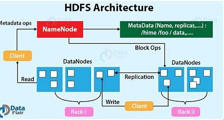
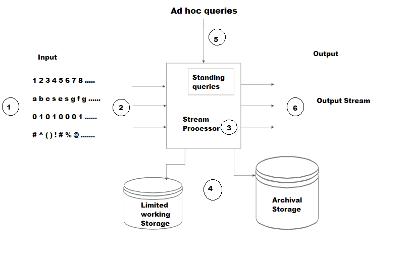

# Questions:

What is big data? challenges of big data.  

Traditional systems and big data approach. 

Five V’s of Big Data. 

Types of big data with examples. 

Define Hadoop and its limitations. 

Explain how node failure is handled in Hadoop. 

Job tracker and task tracker. 

Hadoop core components with its Ecosystem. 

CAP theorem. 

HDFS architecture in detail with diagram. 

Explain MapReduce execution pipeline with suitable example.  

Write a MapReduce pseudo code to multiply two matrices. Apply map reduce working to perform given matrix multiplication. 

Illustrate MapReduce to perform the relational algebraic operations of grouping and aggregations/Union on the given dataset? 

List transaction properties of NoSQL. 

Business drivers behind the NoSQL. 

Key-value pair database architecture pattern. 

Shared nothing architecture in detail. 

Explain distributing models in details. 

Explain how NoSQL systems handle the big data problems. 

 

# 1. Big data: 
refers to extremely large datasets that are too complex to be processed and analyzed using traditional data processing tools. These datasets are characterized by the “5 V’s”:
- Volume: 
The sheer amount of data generated.
- Velocity: 
The speed at which new data is generated and processed.
- Variety: 
The different types of data (structured, unstructured, semi-structured).
- Veracity: 
The quality and accuracy of the data. This involves ensuring the data is trustworthy and reliable.
- Value: 
The potential insights and benefits that can be derived from analyzing the data.

# 2 . Challenges of Big Data
- Data Quality: 
Ensuring the accuracy, completeness, and reliability of data.
- Data Integration: 
Combining data from different sources and formats.
- Storage and Management: 
Efficiently storing and managing vast amounts of data.
- Data Security: 
Protecting sensitive data from breaches and unauthorized access.
- Scalability: 
Ensuring systems can handle increasing amounts of data.
- Data Analysis: 
Extracting meaningful insights from large datasets.
- Cost: 
Managing the expenses associated with big data infrastructure and tools

# 3. Traditional Systems vs. Big Data Approach
> Traditional Systems

- Data Volume: 
Designed to handle smaller datasets, typically in gigabytes or terabytes.
- Data Processing: 
Relies on batch processing, where data is collected, processed, and then analyzed.
- Data Storage: 
Uses relational databases (RDBMS) with structured data and predefined schemas.
- Scalability: 
Limited scalability; scaling up often requires more powerful hardware.
- Data Variety: 
Primarily handles structured data.
- Data Analysis: 
Uses traditional data analysis tools and techniques.

> Big Data Approach

- Data Volume: 
Capable of handling massive datasets, often in petabytes or exabytes.
- Data Processing: 
Utilizes both batch and real-time processing to handle continuous data streams.
- Data Storage: 
Employs distributed storage systems like Hadoop HDFS, NoSQL databases, and cloud storage to manage diverse data types.
- Scalability: 
Highly scalable; can scale out by adding more nodes to the system.
- Data Variety: 
Manages structured, unstructured, and semi-structured data.
- Data Analysis: 
Leverages advanced analytics, machine learning, and AI to extract insights from large datasets.

> Key Differences
- Scalability: 
Big data systems are designed to scale horizontally, adding more servers to handle increased load, whereas traditional systems often scale vertically, requiring more powerful hardware.
- Data Types: 
Big data systems can handle a wider variety of data types, including text, images, videos, and sensor data, while traditional systems are more limited to structured data.
- Processing Speed: 
Big data systems can process data in real-time, providing faster insights, whereas traditional systems often rely on batch processing, which can be slower.

# 4. Big data Types: 
> can be categorized into several types based on its structure and source. Here are the main types along with examples:

1. Structured Data
Definition: Data that is organized in a fixed format, often in rows and columns.
Examples:
Databases: Customer information in a CRM system.
Spreadsheets: Sales data in Excel sheets.

2. Unstructured Data
Definition: Data that does not have a predefined format or structure.
Examples:
Text Files: Emails, social media posts, and documents.
Multimedia: Images, videos, and audio files.

3. Semi-Structured Data
Definition: Data that does not conform to a rigid structure but has some organizational properties.
Examples:
XML/JSON Files: Data exchanged between web services.
Log Files: Server logs and event logs.

4. Geospatial Data
Definition: Data that includes geographical components.
Examples:
Maps: GPS data, satellite imagery.
Location Data: Data from mobile devices indicating user locations.

5. Machine-Generated Data
Definition: Data created by machines without human intervention.
Examples:
Sensor Data: Data from IoT devices, such as temperature sensors.
Web Logs: Data generated by web servers tracking user activity.

6. Human-Generated Data
Definition: Data created by humans through various activities.
Examples:
Social Media: Tweets, Facebook posts, and Instagram photos.
Documents: Word documents, PDFs, and presentations.

# 5. Hadoop: 
is an open-source software framework used for distributed storage and processing of large datasets. It leverages the power of distributed computing to handle massive amounts of data across clusters of computers. The core components of Hadoop include:

- Hadoop Distributed File System (HDFS): 
A distributed file system that stores data across multiple machines.
- MapReduce: 
A programming model for processing large datasets with a parallel, distributed algorithm.
- YARN (Yet Another Resource Negotiator): 
Manages and schedules resources in the cluster.
- Hadoop Common: 
Provides common utilities and libraries that support the other Hadoop modules
- Ecosystem Tools
    - Hive: 
    Data warehousing and SQL-like query language.
    - Pig: 
    High-level platform for creating MapReduce programs.
    - HBase: 
    NoSQL database for real-time read/write access to large datasets.
    - Spark: 
    In-memory data processing engine.
    - Mahout: 
    Machine learning library.
    - Sqoop: 
    Tool for transferring data between Hadoop and relational databases.
    - Flume: 
    Service for collecting and moving large amounts of log data.
    - Oozie: 
    Workflow scheduler to manage Hadoop jobs.
    - Zookeeper: 
    Coordination service for distributed applications

# 6. Limitations of Hadoop
> Despite its advantages, Hadoop has several limitations:

- Small File Handling: 
Hadoop is inefficient at handling a large number of small files, as HDFS is optimized for large files.
- Real-Time Processing: 
Hadoop is designed for batch processing and is not suitable for real-time data processing.
- Iterative Processing: 
It is not efficient for iterative processing tasks, which are common in machine learning algorithms.
- Latency: 
The MapReduce framework can introduce significant latency, making it less suitable for low-latency applications.
- Complexity: 
Setting up and managing a Hadoop cluster can be complex and requires specialized knowledge.
- Security: 
Hadoop’s security model is not as robust as some other systems, which can be a concern for sensitive data.
- Resource Management: 
While YARN improves resource management, it can still be challenging to optimize resource allocation in large clusters.

> These limitations have led to the development of other frameworks like Apache Spark and Apache Flink, which address some of these issues.

# 7. JobTracker and TaskTracker

In Hadoop version 1 (MRv1), JobTracker and TaskTracker are two essential components for executing MapReduce jobs:
> JobTracker

- Role: 
Manages the entire lifecycle of a MapReduce job.

- Functionality: 
Receives job submissions from clients.
Communicates with the NameNode to determine the location of data.
Assigns tasks to TaskTrackers based on data locality and available slots.
Monitors the progress of tasks and handles task failures by reassigning them to other TaskTrackers.

- Location: 
Runs on a separate node, not typically on a DataNode.

> TaskTracker

- Role: 
Executes individual tasks (Mapper and Reducer) assigned by the JobTracker.

- Functionality: 
Runs on DataNodes.
Executes tasks and reports progress back to the JobTracker.
Handles task failures by notifying the JobTracker, which then reassigns the task.
- Location: 
Runs on every DataNode in the cluster.

> In Hadoop version 2, these components have been replaced by ResourceManager, ApplicationMaster, and NodeManager to improve scalability and resource management

# 8. Node failures in Hadoop
In Hadoop, node failure is managed through several mechanisms to ensure data reliability and availability. Here’s how it works:

> Handling DataNode Failure

- Heartbeat Mechanism: 
Each DataNode sends a heartbeat signal to the NameNode at regular intervals (typically every 3 seconds). This signal indicates that the DataNode is functioning properly.

- Block Reports: 
DataNodes also send block reports to the NameNode, detailing all the blocks they store.
> Blocks: files are split into blocks (default size is 128 MB) and stored across DataNodes.

- Detection of Failure: 
If the NameNode does not receive a heartbeat from a DataNode for a specified period (usually 10 minutes), it marks the DataNode as dead.

- Replication: 
Hadoop’s HDFS is designed to replicate data blocks across multiple DataNodes. When a DataNode fails, the NameNode ensures that the blocks stored on the failed DataNode are replicated to other DataNodes to maintain the desired replication factor.

- Rebalancing: 
The NameNode may also initiate a rebalancing process to distribute the data evenly across the remaining DataNodes.

> Handling NameNode Failure

- High Availability (HA): 
In a high-availability setup, Hadoop can have multiple NameNodes (active and standby). If the active NameNode fails, the standby NameNode takes over to ensure continuous operation.

- Checkpointing: 
The NameNode periodically saves the namespace and transaction logs to disk. This process, known as checkpointing, helps in recovering the state of the NameNode in case of a failure.

>Handling Task Failure in MapReduce

- Task Retries: 
If a task fails, the Application Master retries the task on a different node. The number of retries can be configured.

- Speculative Execution: 
Hadoop can run multiple instances of the same task on different nodes. The first instance to complete successfully is used, and the others are killed. This helps in mitigating the impact of slow or failing nodes.

These mechanisms ensure that Hadoop can handle node failures gracefully, maintaining data integrity and availability.

# 9. HDFS Architecture
Hadoop Distributed File System (HDFS) is designed to store large datasets reliably and to stream those data sets at high bandwidth to user applications. Here’s a detailed look at its architecture: Key Components

> NameNode
- Role: 
Acts as the master server that manages the file system namespace and regulates access to files by clients.
- Functions:
Maintains the file system tree and the metadata for all the files and directories. Keeps track of the DataNodes where the actual data blocks are stored. Handles the namespace operations like opening, closing, and renaming files and directories.

> DataNode

- Role: 
Acts as the worker nodes that store the actual data.
- Functions:
Responsible for serving read and write requests from the file system’s clients. Performs block creation, deletion, and replication upon instruction from the NameNode. Sends regular heartbeat signals to the NameNode to report its status and the status of the blocks it stores.

> Secondary NameNode
- Role: 
Assists the primary NameNode.
- Functions:
Periodically merges the namespace image with the edit log to prevent the edit log from becoming too large. Acts as a checkpoint node but does not serve as a backup NameNode.
Checkpoint Node and Backup Node

> Checkpoint Node: 
Periodically creates checkpoints of the namespace.

> Backup Node: 
Provides a read-only copy of the file system metadata.
Data Storage and Replication

- Blocks: 
Files are split into blocks (default size is 128 MB) and stored across DataNodes.
- Replication: 
Each block is replicated across multiple DataNodes (default replication factor is 3) to ensure fault tolerance.

> Data Read and Write Operations
- Write Operation:
    - The client contacts the NameNode to create a new file.
    - The NameNode checks for file existence and permissions.
    - The client writes data to the DataNodes in a pipeline fashion.
    - The DataNodes replicate the data blocks to other DataNodes.
- Read Operation:
    - The client contacts the NameNode to get the locations of the data blocks.
    - The client reads the data directly from the DataNodes.
    

# 10. The CAP theorem: 
also known as Brewer’s theorem, is a fundamental principle in distributed systems, particularly relevant to big data. It states that a distributed data store can only provide two out of the following three guarantees simultaneously:

- Consistency: 
means that all clients see the same data at the same time, no matter which node they connect to. For this to happen, whenever data is written to one node, it must be instantly forwarded or replicated to all the other nodes in the system before the write is deemed ‘successful.’

- Availability: 
means that any client making a request for data gets a response, even if one or more nodes are down. Another way to state this—all working nodes in the distributed system return a valid response for any request, without exception.

- Partition tolerance
A partition is a communications break within a distributed system—a lost or temporarily delayed connection between two nodes. Partition tolerance means that the cluster must continue to work despite any number of communication breakdowns between nodes in the system.

> In the context of big data, the CAP theorem helps in designing and understanding the trade-offs in distributed systems. For example, NoSQL databases often prioritize availability and partition tolerance over consistency to handle large volumes of data and ensure system reliability.

# 11. How NoSql systems handle the big data problems ?
NoSQL systems are designed to handle big data problems effectively by leveraging several key strategies:

- Horizontal Scalability: 
NoSQL databases can scale out by adding more servers to handle increased loads, rather than scaling up by adding more power to a single server. This allows them to manage large volumes of data efficiently.
- Distributed Architecture: 
Data is distributed across multiple nodes, which helps in balancing the load and ensuring high availability. This architecture also supports fault tolerance, as the failure of one node doesn’t affect the overall system.
- Flexible Data Models: 
Unlike traditional relational databases, NoSQL databases can handle unstructured or semi-structured data. This flexibility allows them to adapt to changing data requirements without needing a predefined schema.
- Efficient Query Handling: 
NoSQL systems often move queries to the data rather than moving data to the queries. This reduces the amount of data transferred over the network, making query processing faster.
- Replication and Consistency: 
NoSQL databases use replication to create multiple copies of data across different nodes. This not only ensures data availability but also helps in scaling read requests. Some NoSQL systems offer tunable consistency levels, allowing users to balance between consistency and performance based on their needs.
- MapReduce and Parallel Processing: 
Many NoSQL databases support MapReduce, a programming model that allows for processing large data sets with a distributed algorithm on a cluster. This enables efficient data analysis and transformation.

> Popular NoSQL databases like MongoDB, Cassandra, CouchDB, and Neo4j utilize these strategies to handle big data challenges effectively

# 12. Explain MapReduce execution pipeline with suitable example.
MapReduce model has three major and one optional phase.​

- Mapping:  
It is the first phase of MapReduce programming. Mapping Phase accepts key-value pairs as input as (k, v), where the key represents the Key address of each record and the value represents the entire record content.​The output of the Mapping phase will also be in the key-value format (k’, v’).

- Shuffling and Sorting:  
The output of various mapping parts (k’, v’), then goes into Shuffling and Sorting phase.​ All the same values are deleted, and different values are grouped together based on same keys.​ The output of the Shuffling and Sorting phase will be key-value pairs again as key and array of values (k, v[ ]).

- Reducer:  
The output of the Shuffling and Sorting phase (k, v[]) will be the input of the Reducer phase.​ In this phase reducer function’s logic is executed and all the values are Collected against their corresponding keys. ​Reducer stabilize outputs of various mappers and computes the final output.​

# 13. Properties of NoSQL databases:
- Atomicity: 
A transaction is all-or-nothing. It either completes fully or fails completely, ensuring no partial transactions.
- Consistency: 
The database remains in a consistent state before and after the transaction. This means that any transaction will bring the database from one valid state to another.
- Isolation: 
Transactions are isolated from each other. This ensures that the outcome of a transaction is not affected by other concurrent transactions.
- Durability: 
Once a transaction is committed, it remains so, even in the event of a system failure. The changes made by the transaction are permanently recorded.

These properties are often referred to as the ACID properties, which are crucial for maintaining the reliability and integrity of data in NoSQL databases.

# 14. Key-Value Pair Database Architecture
A key-value pair database is a type of NoSQL database that stores data as a collection of key-value pairs. Here’s a concise overview of its architecture pattern:
> Structure:
- Key: 
A unique identifier for the data. It can be a string, integer, or any other data type.
- Value: 
The data associated with the key. This can be a simple data type (like a string or integer) or a complex object (like JSON, BLOB, etc.).
- Storage:
Data is stored in a hash table where each key is unique. The value can be any type of data, making it flexible for various applications.

> Operations:

- Create: 
Add a new key-value pair.
- Read: 
Retrieve the value associated with a key.
- Update: 
Modify the value associated with a key.
- Delete: 
Remove a key-value pair.

> Advantages:

- Scalability: 
Can handle large amounts of data and high traffic loads.
- Performance: 
Fast data retrieval using keys.
- Flexibility: 
Supports various data types for values.

> Limitations:

- Complex Queries: 
Not suitable for complex queries involving multiple keys.
- Relationships: 
Handling many-to-many relationships can be challenging.

> Use Cases:
- Caching: 
Frequently accessed data can be stored for quick retrieval.
- Session Management: 
Storing user session data in web applications.
- Shopping Carts: 
Managing user-specific shopping cart data in e-commerce applications.

This architecture pattern is particularly useful in scenarios where quick data retrieval and scalability are crucial.

# 15. Shared Nothing Architecture (SNA) 
is a distributed computing model where each node in the system operates independently, without sharing memory or disk storage with other nodes. Here are the key details:

> Core Concepts
- Independence: 
Each node has its own memory, storage, and processing power.
- No Shared Resources: 
Nodes do not share memory or disk storage, reducing contention and bottlenecks.
- Communication: 
Nodes communicate through a high-speed interconnect network, ensuring low latency and high bandwidth.

> Advantages
- Scalability: 
Easily add new nodes to handle increased workloads.
- Fault Tolerance: 
Failure of one node doesn’t affect others.
- Performance: 
Reduced contention leads to better performance.

> Challenges
- Complexity: 
Implementing and maintaining the architecture can be complex.
- Data Consistency: 
Ensuring data consistency across nodes can be challenging.
- Network Dependency: 
Performance heavily depends on the network quality.

> # UNIT 2

# 1. Data Stream Management System
DSMS stands for data stream management system. It is nothing but a software application just like DBMS (database management system) but it involves processing and management of a continuously flowing data stream rather than static data like Excel PDF or other files. It is generally used to deal data streams from with various sources which include sensor data, social media fields, financial reports, etc.

Just like DBMS, DSMS also provides a wide range of operations like storage, processing, analyzing, integration also helps to generate the visualization and report only used for data streams.

There are wide range of DSMS applications available in the market among them Apache Flint, Apache Kafka, Apache Storm, Amazon kinesis, etc. DSMS processes 2 types of queries standard queries and ad hoc queries.

DSMS consists of various layer which are dedicated to perform particular operation which are as follows:

- Data Source Layer: 
Collects data from various sources like sensors, social media, and financial markets.

- Data Ingestion Layer: 
Manages data flow between the source and processing layers, handling buffering and routing.

- Processing Layer: 
The core of DSMS, processes data streams in real-time using engines like Apache Flink or Storm, 
performing tasks like filtering, transforming, and aggregating data.
- Storage Layer: 
Stores processed data in systems like NoSQL or distributed databases, ensuring durability and 
availability.
- Querying Layer: 
Provides tools for querying and analyzing stored data, supporting both ad hoc and standard queries.

- Visualization and Reporting Layer: 
Offers tools for visualizing data (charts, histograms) and generating reports.

- Integration Layer: 
Integrates DSMS with traditional systems, BI tools, data warehouses, and ML/NLP applications.

# 2. Querying large data streams presents several challenges:

- High Throughput and Low Latency: 
Data streams often require real-time processing, meaning the system must handle high volumes of data with minimal delay. This necessitates efficient algorithms and optimized hardware.

- Data Heterogeneity: 
Streams can come from various sources and in different formats, making it difficult to standardize and process the data uniformly.

- Dynamic and Unbounded Nature: 
Unlike static datasets, data streams are continuous and potentially infinite. This requires the system to manage memory and storage efficiently, often using techniques like windowing to process manageable chunks of data.

- Complex Query Processing: 
Queries on data streams can be complex, involving joins, aggregations, and other operations that are computationally intensive. Ensuring these queries run efficiently in real-time is a significant challenge.

- Fault Tolerance and Reliability: 
Ensuring the system can recover from failures without losing data or processing time is crucial. This involves implementing robust fault-tolerance mechanisms.

- Scalability: 
As data volumes grow, the system must scale horizontally (adding more machines) or vertically (upgrading existing machines) to maintain performance.

- Security and Privacy: 
Protecting sensitive data in streams and ensuring compliance with privacy regulations adds another layer of complexity.

# 3. How bloom filter is useful for big data analytics?

Bloom filters are incredibly useful in big data analytics due to their space-efficient and probabilistic nature. Here are some key benefits:

- Space Efficiency: 
Bloom filters use a bit array and multiple hash functions to represent a set, which requires significantly less memory compared to storing the actual data12.

- Fast Membership Testing: 
They allow for quick checks to determine if an element is definitely not in a set or possibly in a set. This is particularly useful for filtering out non-relevant data early in the processing pipeline2.

- Handling Large Datasets: 
In big data scenarios, where datasets can be enormous, Bloom filters help in reducing the amount of data that needs to be processed by eliminating duplicates and irrelevant entries efficiently2.

- Applications in Various Domains: 
They are used in databases for indexing, in network security for detecting malicious URLs, and in distributed systems for efficient data synchronization

