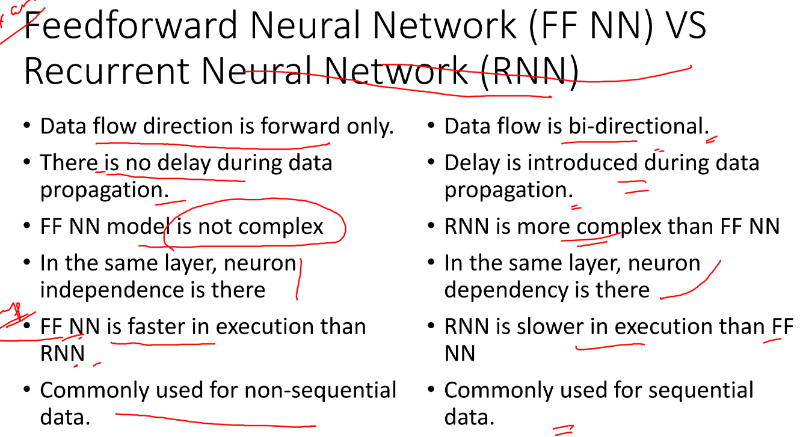
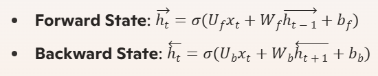

# 1. The sequence learning problem in deep learning: 
involves predicting the next element in a sequence based on previous elements. This is particularly useful in applications like natural language processing (NLP), speech recognition, time series prediction, and music generation.

# 2. Unfolding computational graphs: 
is a technique used to represent and visualize the structure of computations, especially in the context of recurrent neural networks (RNNs) and time series data. By unfolding a computational graph, we can transform a recursive or recurrent computation into a sequence of operations that are easier to analyze and optimize. (`Computational graphs are a type of graph that can be used to represent mathematical expressions.` This is similar to descriptive language in the case of deep learning models, providing a functional description of the required computation.)

# 3. Drawbacks of standard neural network
- Standard neural architecture will not perform well for sequence
models
- Feed fwd network accepts a fixed size vector as the input and
produce a fixed size vector as the output
- Does not share the features learned across the different
positions of the text
- Sequence and length has to be maintained in a network for
further processing

# 4. Feed forward vs RNN:

# 5. Recurrent Neural Networks (RNNs): 
are a type of neural network designed specifically for `sequential data`. They are widely used in tasks where the order of the data points matters, such as time series analysis, natural language processing, and speech recognition. It is a type of Neural Network where the output from the previous step is fed as input to the current step. The main and `most important feature of RNN is its Hidden state`, which remembers some information about a sequence. The state is also referred to as Memory State since it remembers the previous input to the network. The fundamental processing unit in a `Recurrent Neural Network (RNN)` is a `Recurrent Unit`.

### Types Of RNN
There are four types of RNNs based on the number of inputs and outputs in the network.
- One to One 
- One to Many 
- Many to One 
- Many to Many 

### Recurrent Neural Network Architecture
RNNs have the same input and output architecture as any other deep neural architecture. However, differences arise in the way information flows from input to output. Unlike Deep neural networks where we have different weight matrices for each Dense network, in RNN the weight across the network remains the same. The hidden state at time step `t` for input `xi` is calculated as:  
`h= σ(UX + Wh-1 + B)`
`Y = O(Vh + C)`

Hence 
`Y = f (X, h , W, U, V, B, C)`

Here S is the State matrix which has element si as the state of the network at timestep i
The parameters in the network are W, U, V, c, b which are shared across timestep

### Advantages

    An RNN remembers each and every piece of information through time. 
    It is useful in time series prediction only because of the feature to remember previous inputs as well. This is called Long Short Term Memory.
    Recurrent neural networks are even used with convolutional layers to extend the effective pixel neighborhood.

### Disadvantages

    Gradient vanishing and exploding problems.
    Training an RNN is a very difficult task.
    It cannot process very long sequences if using tanh or relu as an activation function.

### Applications of Recurrent Neural Network
    Language Modelling and Generating Text
    Speech Recognition
    Machine Translation
    Image Recognition, Face detection
    Time series Forecasting

# 6. Issues of Standard RNNs
- Vanishing Gradient:
Text generation, machine translation, and stock market prediction are just a few examples of the time-dependent and sequential data problems that can be modelled with recurrent neural networks. You will discover, though, that the gradient problem makes training RNN difficult.
- Exploding Gradient: 
An Exploding Gradient occurs when a neural network is being trained and the slope tends to grow exponentially rather than decay. Large error gradients that build up during training lead to very large updates to the neural network model weights, which is the source of this issue.

# 7. Bidirectional Recurrent Neural Networks (BRNNs) 
are an extension of the standard RNNs that allow for information to flow in both forward and backward directions. This helps the network capture context from both past and future states, making it particularly useful for tasks where the context is essential for understanding.

### How BRNNs Work
- Forward Pass: One RNN processes the sequence from start to end.
- Backward Pass: Another RNN processes the sequence from end to start.
For each time step `t`:

