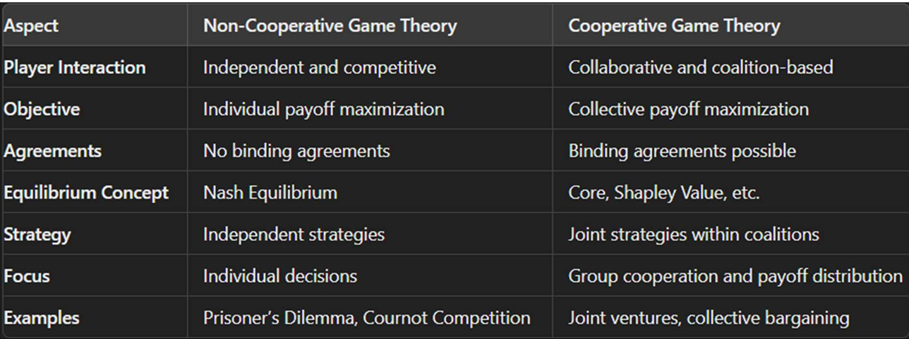

# 1. Essential elements of a game in game theory. 
Game theory is a branch of mathematics that studies strategic interactions between decision-makers, known as “players.” It analyzes situations where the outcome for each participant depends on the choices made by all involved. This field provides tools to model and predict the behavior of players in competitive and cooperative scenarios
In game theory, the essential elements of a game are: 
1. Players: Decision-makers in the game. 
2. Strategies: The complete plan of action a player can take. 
3. Payoffs: Rewards or outcomes received based on chosen strategies. 
4. Information: What players know at various stages of the game. 
5. Actions: Specific choices available to players. 
6. Outcomes: The results of the players' combined actions. 
7. Rules of the Game: The structure and framework governing the game. 
8. Equilibrium: A stable state where no player benefits from changing their strategy.

# 2. Non-Cooperative Game Theory
- Definition: 
Focuses on how rational players make decisions independently, often in competitive settings where binding agreements are not possible.
- Key Features:
    - Individual Strategies: 
    Each player chooses their strategy to maximize their own payoff, considering the strategies of others.
    - Nash Equilibrium: 
    A common solution concept where no player can benefit by changing their strategy unilaterally.
- Examples: 
Prisoner’s Dilemma, Cournot Competition.
Applications: Used in economics, political science, and evolutionary biology to model competitive behaviors and conflicts.

# 3. Cooperative Game Theory
- Definition: 
Focuses on how players can form coalitions and make binding agreements to achieve a common goal, often in collaborative settings.
- Key Features:
    - Coalitions: 
    Players form groups (coalitions) to improve their collective outcomes.
- Examples: 
Bargaining games, coalition formation in politics.
Applications: Used in economics, business, and social sciences to model collaborative behaviors and negotiations

# 4. Key diffrences

# 5. The Prisoner’s Dilemma: 
is a fundamental problem in game theory that demonstrates why two rational individuals might not cooperate, even if it seems that cooperation would be 
in their best interest. 

> Scenario 

Imagine two criminals, Alice and Bob, who are arrested and interrogated separately. The 
police lack sufficient evidence to convict either of a major crime, but they can convict them 
of a lesser offense. The criminals are offered a deal: 
1. If Alice betrays Bob (defects) and Bob remains silent (cooperates), Alice goes free, and Bob gets 10 years in prison. 
2. If Bob betrays Alice and Alice remains silent, Bob goes free, and Alice gets 10 years. 
3. If both betray each other, they both get 5 years in prison. 
4. If both remain silent, they each get 1 year for the lesser offense. 

# 6. Game theory Applications:
Below are two notable applications:

- **Auction Design and Bidding Strategies**: 

    Game theory plays a crucial role in designing and analyzing auctions, particularly in industries where companies bid for resources, licenses, or contracts. For instance, governments use auctions to allocate spectrum licenses to telecommunications companies, and energy markets use auctions to manage electricity supply.

    Game Theory Application: In auctions, companies need to decide how much to bid for a resource, considering both their valuation of the resource and the potential bids of competitors. Game theory models, such as the first-price sealed-bid auction and second-price (Vickrey) auction, help predict bidding strategies.

    Outcome: Game theory provides insights into how bidders strategize, the likely outcomes, and how the auction format can affect overall efficiency and revenue. For instance, in spectrum auctions, this analysis helps governments design auctions that maximize revenue while ensuring fair competition and efficient resource allocation.

- **Oligopolistic Competition and Pricing Strategies** :

    In highly competitive markets, companies often face decisions about pricing their products or services. Game theory provides a framework to analyze how companies interact when making these decisions, considering the potential reactions of competitors. This is particularly evident in industries where only a few firms dominate, like airlines, telecommunications, or retail.

- **International Relations and Conflict Resolution**:

    In international relations, countries often face decisions about forming alliances, engaging in trade, or escalating conflicts. Game theory is used to analyze the strategic interactions between nations, especially when decisions involve high stakes, like nuclear deterrence or trade tariffs.

# 7. Rational choice theory: 
Rational Choice Theory (RCT) is a framework used in economics, sociology, and political science to understand and model human behavior. It assumes that individuals make decisions by weighing the costs and benefits to maximize their personal advantage. This theory assumes that people are rational actors who aim to achieve the most favorable outcome based on their preferences and available information. 

Example: Imagine a student deciding whether to study for an exam or go to a party. According to RCT, the student will evaluate the potential outcomes of both choices. Studying might increase the likelihood of a good grade (which the student values), while going to the party might provide immediate enjoyment but could harm academic performance. If the student values academic success more and believes studying will provide long-term benefits, they will likely choose to study. Viceversa ....

# 8. Strategy: 
is a set of rules or actions a player commits to, which dictates how they will respond to various situations or actions taken by other players.
> Types: 

- Pure Strategy: A specific, predetermined action a player will take in every possible situation (e.g., always choosing to cooperate in the Prisoner’s 
Dilemma). 

-  Mixed Strategy: A probabilistic approach where a player chooses among different actions according to a set probability distribution (e.g., randomly choosing between several actions to keep opponents uncertain). 

> Example: Rock-Paper-Scissors: 
- Pure Strategy: Always choose Rock. 
- Mixed Strategy: Choose Rock, Paper, or Scissors with equal probability (1/3 each). 

# 9. A pure strategy Nash Equilibrium: 
is a situation in a game where each player chooses a single, specific strategy, and no player can benefit by unilaterally changing their strategy, given that 
other players stick to their chosen strategies. In other words, it's a stable state where each 
player's strategy is the best response to the strategies of the others. 

>Example: The Prisoner’s Dilemma
Consider the classic Prisoner’s Dilemma:

- Players: Two criminals, Alice and Bob.
Strategies: Each can either Confess © or Stay Silent (S).

- Payoffs:
If both confess, they each get 5 years in prison.
If one confesses and the other stays silent, the confessor goes free, and the silent one gets 10 years. If both stay silent, they each get 1 year in prison.

> Finding the Nash Equilibrium

- Alice’s Best Response:

    - If Bob confesses ©, Alice’s best response is to confess © because -5 (confess) is better than -10 (stay silent).
    - If Bob stays silent (S), Alice’s best response is to confess © because 0 (confess) is better than -1 (stay silent).

- Bob’s Best Response:
    - If Alice confesses ©, Bob’s best response is to confess © because -5 (confess) is better than -10 (stay silent).
    - If Alice stays silent (S), Bob’s best response is to confess © because 0 (confess) is better than -1 (stay silent).

Since both Alice and Bob’s best responses are to confess regardless of the other’s choice, (C, C) is a pure strategy Nash Equilibrium. Neither Alice nor Bob can improve their situation by unilaterally changing their strategy.

# 10. Classification of Game Theory: 
> Game theory can be classified based on various criteria: 

**1. By Number of Players**: 
- Two-Player Games: Games involving exactly two players (e.g., Prisoner’s Dilemma). 
- N-Player Games: Games involving more than two players (e.g., Public Goods Games). 

**2. By Type of Strategies**: 
- Pure Strategy Games: Each player chooses a single strategy with certainty 
(e.g., Rock-Paper-Scissors). 

- Mixed Strategy Games: Players choose among strategies with certain probabilities (e.g., randomized strategies in games like poker). 

- Dominant Strategy: A dominant strategy is one that always provides a better outcome for a player, regardless of what the other players do. It is the best choice in every possible scenario. 

    - Example: Prisoner’s Dilemma 
        Defect (betray) is a dominant strategy for both players because it leads to a better or equal outcome compared to cooperating, regardless of the other player’s action. 

**3. By Information Availability**: 
- **Complete / perfect Information**: games where all players have 
complete knowledge of the game's structure and all previous actions taken by other players. There are no hidden information or unknown moves; each player isfully informed about the game's state at all times. 

- Incomplete Information: Players have limited knowledge about other players' payoffs or strategies (e.g., auctions with unknown valuations). 

**4. By Timing of Moves**: 
- Simultaneous-Move Games: Players make decisions without knowing the other players’ choices (e.g., The Prisoner’s Dilemma). 

- Sequential-Move Games: Players make decisions one after another, with later players having knowledge of earlier moves (e.g., Chess). 

**5. By Type of Payoff Structure**: 
- Zero-Sum Games: One player’s gain is exactly balanced by the losses of others (e.g., Poker). 
- Non-Zero-Sum Games: The total gains and losses are not necessarily balanced, allowing for mutually beneficial outcomes (e.g., Trade Negotiations). 

# 11. Saddle point:
In game theory, a saddle point (or minimax point) is a crucial concept in zero-sum games. It represents a situation where the chosen strategies of both players intersect, leading to an optimal outcome for both, given the constraints of the game. 

A saddle point in a payoff matrix is an entry that is:
The smallest value in its row (minimizing the maximum loss for the row player).
The largest value in its column (maximizing the minimum gain for the column player).

# 12. Oligopoly: 
is a market structure characterized by a small number of firms that have significant market power. Each firm's decisions affect the others, leading to strategic 
interactions. Oligopoly models analyze how firms in such markets make decisions regarding pricing, output, and other strategic variables. 
> Here are some key oligopoly models: 

1. Cournot Model: 
The Cournot Model focuses on quantity competition. Firms decide how much to produce, and the market price is determined by the total quantity produced. 

    > Key Features: 
    - Firms produce a homogeneous product. 
    - Each firm chooses its output level to maximize profit, assuming the output levels of other firms are fixed. 
    - Firms have complete information about market demand and production costs. 
    > The equilibrium is reached when no firm can increase its profit by changing its output, given the output of the other firms.

2. Bertrand Model: 
The Bertrand Model focuses on price competition. Firms compete by setting prices rather than quantities. The model assumes that firms produce identical products. 

> # UNIT - 2

# 1. Bayesian games: 
are a type of game in game theory where players have incomplete information about the other players. This means that each player has private information that others do not know, such as their preferences, payoffs, or strategies. The concept was introduced by John C. Harsanyi, who won the Nobel Prize in Economics for his contributions to game theory. Key Elements of Bayesian Games:
- Players (N): 
The set of players involved in the game.
- Actions (A): 
The set of actions available to each player.
- Types (T): 
The set of possible types for each player, representing their private information.
- Payoff Functions (u): 
The payoffs each player receives, which depend on their type and the actions taken.
- Prior (p): 
A probability distribution over the possible types, representing the players’ beliefs about each other’s types.
    
## Example of a Bayesian Game: 
Let’s consider a simple sealed-bid auction in which two players (Player 1 and Player 2) are bidding for an object. Each player has a private valuation of the object, which is unknown to the other player. The players bid without knowing each other's valuation and the highest bid wins the auction. If a player wins, they get the object and pay the amount they bid, and if they lose, they get nothing.

# 2. Extensive-form games and perfect subgame Nash equilibrium: 
(also known as subgame perfect equilibrium or SPE) are key concepts in game theory, but they address different aspects of strategic interaction.

## Extensive Form Games
is a representation of a game that captures the sequential nature of decision-making. Unlike normal-form games (which represent simultaneous decisions in a matrix), extensive-form games explicitly account for the order in which players make their moves, as well as the information available to them at each decision point. These games are typically represented by a game tree, where nodes represent decision points, branches represent possible actions, and terminal nodes represent the outcomes/payoffs for each player. 

Example:
A simple example of an extensive-form game is the classic sequential game of chess or a negotiation game, where one player moves first and the second player reacts based on that move.

## Subgame Perfect Nash Equilibrium (SPNE)
A subgame perfect Nash equilibrium is a refinement of Nash equilibrium applicable to extensive form games. It ensures that players’ strategies constitute a Nash equilibrium in every subgame of the original game. This concept is crucial because it eliminates non-credible threats and ensures rational behavior at every stage of the game.

# 3. A normal form game: 
is a way to represent strategic interactions among players where each player’s strategies and payoffs are outlined in a matrix format. This representation is particularly useful for analyzing games where players make decisions simultaneously.

ex: `Matching Pennies`
Two players simultaneously place a penny on the table. Each player can choose Heads or Tails. The payoffs are:
> Table

    Player 2: Heads	Player 2: Tails
    Player 1: Heads	(1, -1)	(-1, 1)
    Player 1: Tails	(-1, 1)	(1, -1)

- If the pennies match, Player 1 wins (+1) and Player 2 loses (-1).
- If the pennies do not match, Player 2 wins (+1) and Player 1 loses (-1).

# 4. Combinatorial auctions. Challenges and strategies

Combinatorial auctions are auction formats where bidders can place bids on combinations of items rather than just individual ones. This allows participants to express their preferences more flexibly, especially when the items have complementary or substitutive relationships. These auctions are particularly useful in scenarios like spectrum auctions for telecommunications, where multiple frequency bands are sold together.

## Challenges in Combinatorial Auctions

- Winner Determination Problem: 
Determining the optimal allocation of items to maximize total value is computationally complex. This problem, known as the winner determination problem, is NP-hard, meaning it can be very difficult to solve efficiently as the number of items and bids increases.

- Strategic Bidding: 
Bidders must consider not only their own valuations but also anticipate the bids of others. This strategic complexity can lead to uncertainty and suboptimal bidding.

- Incentive Compatibility: 
Designing mechanisms that encourage truthful bidding is challenging. If bidders believe they can gain an advantage by misrepresenting their valuations, the auction’s efficiency can be compromised.

- Bidder Participation: 
The complexity of the auction process can deter participation. Bidders may feel overwhelmed by the need to calculate optimal bids for numerous combinations.

## Strategies for Designing Mechanisms

- Iterative Auctions: 
Using iterative combinatorial auctions, where bidders can adjust their bids over multiple rounds, can help manage complexity and improve outcomes. Examples include the Clock-Proxy Auction and the Ascending Proxy Auction.

- Bidding Languages: 
Developing expressive bidding languages allows bidders to more easily communicate their preferences for combinations of items. This can simplify the bidding process and improve the accuracy of bids.

- Algorithmic Solutions: 
Employing sophisticated algorithms to solve the winner determination problem can enhance efficiency. Techniques like linear programming and heuristic methods are often used.

- Decision Support Tools: 
Providing bidders with tools to help them formulate and adjust their bids can reduce the cognitive load and encourage participation.

Combinatorial auctions hold great potential for improving resource allocation and increasing auction revenues, but they require careful design to address these challenges effectively.

