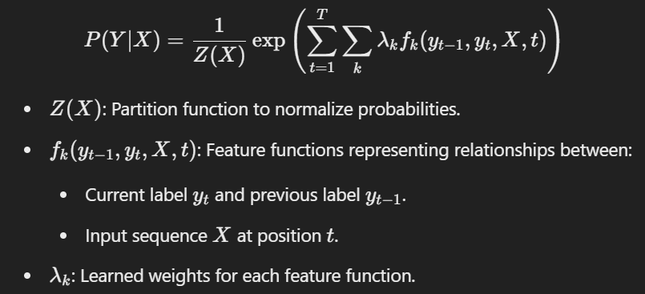
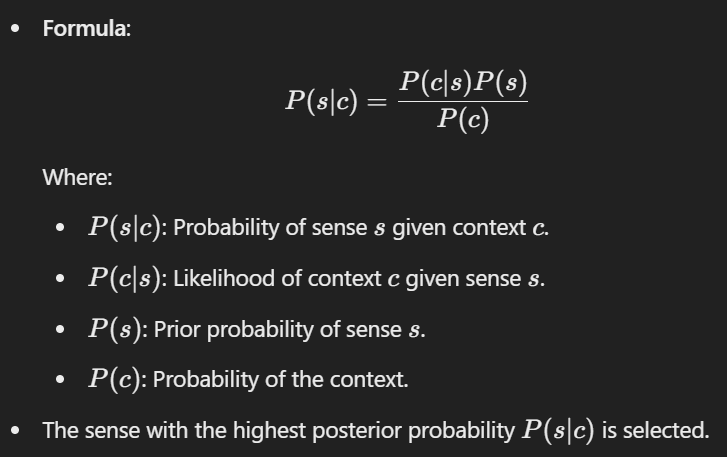

# `UNIT - 1 / 2`

# 1. Lexical Analysis (Tokenization): 
is the process of splitting text into smaller units, called tokens. Tokens can be words, sentences, or subwords, depending on the level of tokenization. 
## Examples
- Sentence Tokenization: Splitting a paragraph into sentences.
    - Input: `"I love NLP. It is fascinating!"`
    - Output: `[I love NLP.", "It is fascinating!"]`
- Word Tokenization: Splitting sentences into words or subwords.
    - Input: `"I love NLP!"`
    - Output: `["I", "love", "NLP", "!"]`

## Need of tokenization
- Effective Text Processing: Reduces the size of raw text for easier handling.
- Feature Extraction: Represents text data numerically for machine learning models.
- Language Modelling: Helps create organized representations of language.
- Information Retrieval: Essential for efficient indexing and searching.
- Text Analysis: Used in tasks like sentiment analysis and named entity recognition.
- Vocabulary Management: Manages a corpus’s vocabulary by generating distinct tokens.
- Task-Specific Adaptation: Customizable for specific NLP tasks.
- Preprocessing Step: Transforms unprocessed text for further analysis.

# 2. Stemming
is the process of reducing a word to its root form by removing prefixes or suffixes. The resulting stem might not always be a valid word, as the focus is on shortening rather than grammatical accuracy. **Example:**

- Input: `"running, runner, runs"`
- Output: `["run", "run", "run"]`
- Limitation:
Stemming may not always produce meaningful or grammatically correct words, e.g., `"better" → "bett"`.
A popular stemming algorithm is the Porter Stemmer.

## Benefits:

- Simplicity: 
Stemming is straightforward and computationally inexpensive.
- Speed: 
Faster processing time due to simple rules and lack of context consideration.
- Useful in applications where speed is crucial, such as search engines

## Limitations:

- Accuracy: 
Can produce stems that are not actual words, leading to less accurate results.
- Over-Stemming: 
Can sometimes strip too much off a word (e.g., “running” to “runn”).
- Under-Stemming: 
Can sometimes strip too little off a word (e.g., “running” to “run”).

# 3. Porter stemmer
is a widely used and influential stemming algorithm in Natural Language Processing (NLP). It was developed by Martin Porter in 1980 and is designed to reduce words to their root or base form (stem) by systematically removing suffixes. Unlike lemmatization, Porter stemming does not necessarily produce grammatically correct words but instead focuses on simplifying terms for information retrieval and text analysis.

## Steps of the Porter Stemming Algorithm:
The algorithm works by applying a series of rules to remove common suffixes from words. These rules are applied in a specific order to ensure that the stemming process is consistent and accurate. Here are the main steps:

- **Plurals and Past Participles:** Removes suffixes like 's', 'es', 'ed', 'ing' (e.g., "hopping" → "hop").
- **Derivational Suffixes:** Simplifies endings like 'ational' → 'ate' (e.g., "relational" → "relate").
- **Other Derivational Endings:** Strips suffixes like 'icate', 'ful', 'ness' (e.g., "hopefulness" → "hope").
- **Additional Suffixes:** Removes endings like 'al', 'ance', 'er' (e.g., "formalize" → "formal").
- **Final Adjustments:** Removes or retains 'e' based on its necessity (e.g., "probate" → "probat").

# 4. Segmentation
It is similar to `tokenization` but we focus on spiltting the sentences or paragraphs by `logical boundries` rather than just words or sentences. 

For example, the paragraph "I love programming. It's both challenging and rewarding." can be segmented into:
- "I love programming."
- "It's both challenging and rewarding."

# 5. Lemmatization
Lemmatization reduces words to their `dictionary base form` (lemma) while `preserving grammatical meaning`. Unlike stemming, it ensures that the output is a valid word. **Example:** for input 
- `better → good`, `caring → care`
- in case of `stemming`: `caring → car`

## How Lemmatization Works? Lemmatization involves several steps:

- **Part-of-Speech (POS) Tagging:** 
Identifying the grammatical category of each word (e.g., noun, verb, adjective).

- **Morphological Analysis:** 
Analyzing the structure of the word to understand its root form.

- **Dictionary Lookup:** 
Using a predefined vocabulary to find the lemma of the word. For example, the word “better” would be lemmatized to “good” if it is identified as an adjective, whereas “running” would be lemmatized to “run” if identified as a verb.

## Techniques in Lemmatization

- **Rule-Based Lemmatization:** 
Uses predefined grammatical rules to transform words. For instance, removing the “-ed” suffix from regular past tense verbs.

- **Dictionary-Based Lemmatization:** 
Looks up words in a dictionary to find their base forms.

- **Machine Learning-Based Lemmatization:** 
Employs machine learning models trained on annotated corpora to predict the lemma of a word.

## Benefits:
- **Accuracy:** 
Lemmatization provides more accurate results because it considers the context and meaning of words.
- **Standardization:** 
Ensures words are reduced to their dictionary form, aiding in tasks like text normalization and information retrieval.

## Limitations:

- **Complexity:** 
Requires more computational resources and a comprehensive dictionary.
- **Dependency on POS Tagging:** 
Requires accurate POS tagging, which adds to the processing overhead.

# 6. The Edit Distance algorithm
also known as `Levenshtein Distance`, is a way to measure how `different` two strings are by calculating the `minimum number of operations` required to `transform` one string into another. It is widely used in NLP for tasks like `spelling correction, approximate string matching, and fuzzy search`.

## The algorithm allows three basic operations:
- **Insertion:** Adding a character.
E.g., Transform "cat" → "cats" (insert 's').
- **Deletion:** Removing a character.
E.g., Transform "cats" → "cat" (delete 's').
- **Substitution:** Replacing one character with another.
E.g., Transform "cat" → "cut" (substitute 'a' with 'u').

Each operation is assumed to have a cost of 1 (though this can vary in some implementations). 

## Working
The algorithm use a `dynamic programming` based approch to calculate the `edit distance` efficiently. It uses a `matrix` to compute distances in a `step-by-step manner`.

- **Matrix Setup:**
Create a table (matrix) where `rows represent the characters of one string` and `columns represent the other`. The table tracks the minimum number of operations required to align substrings.

- **Initialization:**
    - Fill the first row with incremental costs for `transforming an empty string into the second string` (insertions).

    - Fill the first column with incremental costs for `transforming the first string into an empty string` (deletions).

- **Dynamic Programming Update:** For each cell (i, j) in the matrix: Calculate the minimum cost using formula:

`dp[i][j] = min(dp[i][j - 1] + 1, dp[i - 1][j] + 1, dp[i - 1][j - 1] + cost)`

The value in the `bottom-right cell` of the matrix gives the `total minimum edit distance between the two strings`.

## Applications in NLP
- **Spelling Correction:**
Suggest words with a small edit distance from the misspelled word. E.g., "recieve" → "receive" (edit distance = 1).
- **Plagiarism Detection:**
Measure similarity between texts by computing edit distances.
- **DNA Sequence Alignment:**
Compare biological sequences.
- **Autocomplete Systems:**
Rank suggestions based on their edit distances from the input query.

# 7. Collocations: 
are `word pairs` or groups of words that `frequently appear together` in a language, forming a `natural combination`. These combinations are used by native speakers to express ideas more naturally. Understanding collocations is important in Natural Language Processing (NLP) as they often carry specific meanings or contexts that differ from their individual words.  Examples: `strong tea, heavy rain, big mistake`. "Strong tea" sounds natural, while "powerful tea" does not.

# 8. Morphological Analysis: 
in Natural Language Processing (NLP) is the process of `analyzing the structure of words` to understand `their components and relationships`.

Morphology is the branch of `linguistics` concerned with the `structure and form of words in a language`. Morphological analysis, in the context of NLP, refers to the `computational processing of word structures`. It aims to `break down` words into their `constituent parts`, such as roots, prefixes, and suffixes, `and understand their roles and meanings`. This process is essential for various NLP tasks, including language modeling, text analysis, and machine translation.

## Importance of Morphological Analysis
- **Understanding Word Formation:** It helps in identifying the basic building blocks of words, which is crucial for language comprehension.
- **Improving Text Analysis:** By breaking down words into their roots and affixes, it enhances the accuracy of text analysis tasks like sentiment analysis and topic modeling.
- **Enhancing Language Models:** Morphological analysis provides detailed insights into word formation, improving the performance of language models used in tasks like speech recognition and text generation.
- **Facilitating Multilingual - Processing:** It aids in handling the morphological diversity of different languages, making NLP systems more robust and versatile.

## Key techniques used in morphological analysis:

- **Stemming**
- **Lemmetization**
- **Morphological Parsing:**
involves analyzing the structure of words to identify their morphemes (roots, prefixes, suffixes). It requires knowledge of morphological rules and patterns. FSTs are computational models used to represent and analyze the morphological structure of words. They consist of states and transitions, capturing the rules of word formation.
- **Neural network models:** 
especially deep learning models, can be trained to perform morphological analysis by learning patterns from large datasets.
- **Rule-based methods:** 
rely on manually defined linguistic rules for morphological analysis. These rules can handle specific language patterns and exceptions.
    - Applications:
        - Affix Stripping: Removing known prefixes and suffixes to find the root form.
        - Inflectional Analysis: Identifying grammatical variations like tense, number, and case.

## Morphology Types:

- **Derivational Morphology:** 
The process of creating new words by adding prefixes or suffixes to a root, often changing the word's meaning or part of speech.
Example: happy → happiness (adjective → noun).
- **Inflectional Morphology:**
The process of adding grammatical information to a word (e.g., tense, number, gender) without changing its core meaning or part of speech.
Example: walk → walked (verb → past tense verb).

# 9. The Hidden Markov Model (HMM) 
- is a `statistical model` that is used to describe the `probabilistic relationship` between a `sequence of observations` and a `sequence of hidden states`. 
- It is `often used` in situations where the `underlying system or process that generates the observations is unknown or hidden`, hence it has the name “Hidden Markov Model.” 
- It is used to `predict` future observations `or classify` sequences, based on the `underlying hidden process` that generates the data.
- **An HMM consists of two types of variables:**
    - **Hidden states:** are the underlying variables that generate the observed data, but they are not directly observable.
    - **Observations:** are the variables that are measured and observed.
- The `relationship` between the hidden states and the observations is `modeled` using a `probability distribution`.
    - **Transition probabilities:** probability of transitioning from one hidden state to another.
    - **Emission probabilities:** probability of observing an output given a hidden state.

## Steps involved:
- Identify all possible hidden states and observations.
- Establish the probability distribution over the initial state.
- Create the transition matrix that describes the probabilities of moving from one state to another.
- Create the emission matrix that describes the probabilities of generating each observation from each state.
- Use algorithms like `Baum-Welch` or `forward-backward` to estimate the parameters iteratively until convergence.
- Apply the `Viterbi algorithm` to compute the most likely sequence of hidden states based on the observed data.
- Assess the model's performance using metrics such as accuracy, precision, recall, or F1 score.

HMMs are widely used in a variety of applications such as speech recognition, natural language processing, computational biology, and finance.

# 10. N-gram language model: 
is a statistical model used in Natural Language Processing (NLP) to `predict the probability` of a `sequence of words in a sentence` or text. It uses a `Markov assumption` to estimate the `likelihood of a word` based only on the `n-1 preceding words`, rather than the entire sentence history.

The n-gram language model is used in spelling correction to predict the most probable word or sentence by analyzing the context and identifying likely sequences of words.
## Strengths
- **Simplicity:** Easy to implement and interpret.
- **Efficient:** Works well with sufficient training data.
- **Foundation:** Forms the basis for more advanced language models.
## Weaknesses
- **Data Sparsity:** Struggles with unseen n-grams (low generalization).
- **Context Limitations:** Cannot capture long-term dependencies.
- **Exponential Growth:** Larger n-grams require exponentially more data.
## Applications
- **Speech Recognition:** Predict the next word in spoken sentences.
- **Machine Translation:** Rank possible translations based on probabilities.
- **Text Generation:** Create coherent text sequences.

------------------------------------------------------------------------------------------------------------------------------------------

# `UNIT - 2`

# 1. Part-of-Speech (POS) tagging: 
is a process in Natural Language Processing (NLP) where each word in a text is assigned a specific part of speech, such as noun, verb, adjective, etc., based on its context. This helps in understanding the grammatical structure and meaning of the sentence.

## Different Approaches to POS Tagging

- **Rule-Based Tagging:** 
Uses a set of hand-written linguistic rules.

- **Statistical Tagging:** 
leverages probabilistic models like Hidden Markov Models (HMM) and Conditional Random Fields (CRF).

- **Transformation-Based Tagging:** 
Also known as Brill Tagging, this method combines the benefits of rule-based and machine-learning approaches. it applies transformation rules to improve initial tagging.

- **Neural Network-Based Tagging:** 
Employs deep learning models like Recurrent Neural Networks (RNN) and Long Short-Term Memory (LSTM) networks.

- **Hybrid Tagging:** 
Combines multiple approaches to leverage their strengths.

# 2. Rule-Based Tagging: 
is one of the earliest methods used for Part-of-Speech (POS) tagging. It relies on a set of hand-crafted linguistic rules to assign tags to words. Here’s a detailed explanation:

## How Rule-Based Tagging Works

- **Lexical Lookup:** 
Initially, each word in the text is assigned a list of possible tags based on a dictionary or lexicon. For example, the word “book” might be tagged as a noun (NN) or a verb (VB).

- **Contextual Rules:** 
The system then applies a series of contextual rules to narrow down the possible tags. These rules are based on the linguistic context of the words. For example:

    - If a word is preceded by a determiner (like “the” or “a”), it is likely to be a noun.

    - If a word ends in “ing” and is preceded by a verb, it is likely to be a present participle (VBG).

- **Disambiguation:** 
The rules are applied iteratively to resolve ambiguities and assign the most appropriate tag to each word. For instance:
“He can fish” vs. “He bought a can of fish.” In the first sentence, “can” is a verb, while in the second, it is a noun.

## Advantages:

- Simple and interpretable.
- Effective for languages with well-defined grammatical rules.

## Disadvantages:

- Requires extensive manual effort to create and maintain rules.
- May not handle ambiguous or unseen words well.
- Less effective for languages with complex or less rigid grammatical structures.

# 3. Stochastic POS Tagging: 
is an approach to Part-of-Speech (POS) tagging that leverages probabilistic models to assign tags to words in a sequence. Instead of relying on handcrafted rules (as in rule-based systems), it uses statistical methods based on training data to determine the most likely tag for a given word, considering both the word itself and its context.

## Types:
- N-gram Model
- HMM
- CRF

## Advantages:
- **Robust to Ambiguity:** Probabilities allow handling of ambiguous cases based on context.
- **Automated Learning:** Does not require manually written rules, reducing human effort.
- **Scalable:** Can adapt to large corpora and new languages/domains.
## Disadvantages:
- **Data Dependency:** Requires a large annotated corpus to train the model.
- **Computational Cost:** HMM tagging (or other n-gram models) can be computationally expensive for large sequences.
- **Error Propagation:** Errors in probabilities or limited training data can lead to cascading tagging mistakes.

# 4. Transformation-Based Tagging (TBL)
Also known as Brill Tagging, this method combines the benefits of rule-based and machine-learning approaches.  it applies transformation rules to improve initial tagging

## Key Features:
- **Error-Driven Learning:** Instead of manually crafting rules, TBL learns rules from a tagged training corpus.
- **Initial Tagging:** Starts with a baseline tagging (often rule-based or lexicon-based).
- **Rule Induction:** Learns transformation rules that correct tagging errors iteratively.

## Steps:
- **Initial Tagging:** Apply a baseline tagger to assign tags (e.g., a simple lexicon-based tagger).
- **Error Analysis:** Compare the tags with the correct tags in the training data to identify errors.
- **Rule Generation:** Generate transformation rules to correct the most frequent errors.
- **Apply Rules:** Iteratively apply the learned rules to refine the tagging.

## Example Rule:
If a word is tagged as a noun (NN) but is preceded by a determiner and followed by a verb, change the tag to a verb (VB).

## Advantages:

- Adaptable to new languages and domains since rules are learned automatically.
- Less reliance on extensive hand-crafted rules compared to purely rule-based systems.
## Disadvantages:
- Requires a tagged corpus for training.
- Computationally intensive during the rule-learning phase.

# 5. Issues in POS Tagging

- **Multiple Tags for a Word:**
    - **Challenge:** Words like "bank" can have multiple possible tags depending on context (e.g., noun or verb).
    - **Solution Approaches:** 
        - **Use contextual models:** like n-grams, HMMs. Example: A bigram model might use `P(i | i-1)` to resolve ambiguity based on the previous tag.
        - **Apply rule-based disambiguation:** Add context-sensitive rules in a rule-based system to prioritize one tag over another. 
            - Example: If preceded by a determiner `("the")`, tag `"bank" as a noun`.
        - Leverage machine learning models trained on large corpora.

- **Unknown Words:**
    - **Challenge:** `Out-of-vocabulary (OOV)` words such as rare terms, slang, or domain-specific jargon lack training data for tagging.
    - **Solution Approaches:** 
        - Use morphological analysis (e.g., suffixes like -ing for verbs).
        - **Contextual Cues:**
            - Leverage surrounding words and their tags to predict the unknown word's tag.
            - Example: In `"She quickly zarged the door"`, the structure suggests `zarged` is likely a `verb` (VB).

        - **Probabilistic Models:** Assign tags based on the probabilities of similar known words or fallback to the most frequent tag in the training data.
        - **Word Embeddings (in Modern Systems):** Use vector representations like `Word2Vec` or `contextual embeddings` like `BERT` to infer the meaning of unknown words based on their context.

# 6. Conditional Random Fields (CRFs): 
are `probabilistic` models used for sequence labeling tasks in NLP, such as part-of-speech tagging, named entity recognition (NER), or shallow parsing.
It is a variant of a `Markov Random Field (MRF)`, which is a type of `undirected graphical` model.

CRFs are an `extension of logistic regression` for structured prediction. Unlike simpler models that predict labels independently, `CRFs consider` the `dependencies` between labels in the sequence. This enables them to `capture the context and relationships` between adjacent labels, which is crucial in many NLP tasks.

## Working:
CRFs work by modeling the conditional probability of a sequence of `labels: Y = (y1, y2, y3 ..)` 
given an `observation sequence: X = (x1, x2, x3 ..)`. The model assigns a probability to the entire sequence, considering the relationships between the labels and the input features using the below `formula`:

- **Feature Functions Encodes characteristics of the input and relationships between labels.**
- The weights `λk` are learned by maximizing the `conditional log-likelihood` of the labeled training data using techniques like `gradient descent` or `quasi-Newton methods`.
- Algorithms like `Viterbi` are used to find the most probable label sequence `𝑌∗` for a given input `𝑋`

## Advantages:

- Capture contextual dependencies between labels.
- Allow the use of overlapping and non-independent features.

## Limitations
- Computationally expensive, especially for large datasets or complex tasks.
- Require feature engineering unless combined with neural networks in hybrid models.

------------------------------------------------------------------------------------------------------------------------------------------

# `UNIT - 4`

# 1. Semantic analysis: 
is a subfield of Natural Language Processing (NLP) that focuses on understanding the `meaning of words, phrases, and sentences` in context. It goes beyond syntactic processing (which analyzes the grammatical structure of language) to extract the intended meaning and relationships in textual or spoken data.
## Key Objectives of Semantic Analysis
- **Understanding Word Meaning:**
Identify and interpret the meaning of individual words, considering their context (e.g., "bank" as a financial institution vs. a riverbank).#
- **Contextual Meaning:**
Resolve ambiguities and understand the overall meaning of sentences or paragraphs based on linguistic context.#
- **Extracting Relationships:**
Identify relationships between entities (e.g., "Paris is the capital of France").#
- **Structuring Unstructured Data:**
Convert unstructured text into structured data for better analysis, such as extracting facts or building knowledge graphs.

## Levels of Semantic Analysis
- Word-Level Semantics
- Sentence-Level Semantics
- Discourse-Level Semantics: Explores the meaning of multiple sentences in a broader context.
- World Knowledge: Uses external knowledge (e.g., databases, ontologies) to enhance understanding. Example: Knowing that "Paris" refers to a city in France, not a person.

# 2. Lexical semantics: 
is a branch of linguistics and computational linguistics that focuses on the study of word meanings and their relationships. It aims to understand how individual words convey meaning, how meanings vary in different contexts, and how words relate to one another in a language.
## Key Components of Lexical Semantics
- **Word Meaning:** Investigates the meaning of individual words (lexemes) and how they are understood in isolation or context.
    - **Example:** The word "bank" can mean a financial institution or the side of a river, depending on the context.

- **Word Relationships:** Explores relationships between words, such as:
    - **Synonymy:** Words with similar meanings (e.g., "big" and "large").
    - **Antonymy:** Words with opposite meanings (e.g., "hot" and "cold").
    - **Hyponymy:** Hierarchical relationships where one word is a subset of another (e.g., "sparrow" is a hyponym of "bird").
    - **Meronymy:** Part-whole relationships (e.g., "wheel" is a part of "car").
    - **Polysemy:** A single word having multiple related meanings (e.g., "light" as in "not heavy" and "illumination").
    - **Homonymy:** Words with the same form but unrelated meanings (e.g., "bat" as in the animal and "bat" used in sports).

- **Word Sense:** Each word can have multiple senses or meanings depending on context.
    - **Example:** 

            The word "run" can mean:
            To move quickly on foot.
            To manage (e.g., "run a business").
            To operate (e.g., "run a program").

- **Semantic Roles:** Assign roles to words in a sentence to understand their function in conveying meaning.
    - **Example:** 
    
            In "John gave Mary a book," the roles are:
                John (giver)
                Mary (recipient)
                Book (item).

# 3. WordNet: 
is a large, publicly available `lexical` database for the English language. It organizes words into `sets of synonyms (called synsets)` and `encodes` relationships between these sets to `represent semantic and lexical` relationships. WordNet is widely used in natural language processing (NLP) tasks like word sense disambiguation, information retrieval, and semantic similarity measurement.
## Key Terms in WordNet
- **Synset (Synonym Set):** A synset is a group of words or phrases that are interchangeable in a specific context because they have the same or very similar meanings.
    - **Example:** The words `car, automobile, and motorcar` belong to the `same synset` because they refer to the same concept.
- **Gloss:** A gloss is the textual definition or explanation of the concept represented by a synset. Glosses help clarify the meaning of the synset and are often used in tasks like word sense disambiguation.
    - **Example:** The synset `{car, automobile, motorcar}` has the gloss: `"a motor vehicle with four wheels; usually propelled by an internal combustion engine."`

# 4. BabelNet: 
is a multilingual lexical and semantic network that integrates lexicons, dictionaries, and encyclopedias, such as WordNet and Wikipedia, to create a comprehensive resource for understanding words and concepts across multiple languages.

# 5. Semantic Ambiguity: 
occurs when a word, phrase, or sentence has more than one meaning or interpretation due to the flexibility or vagueness of its semantics. In other words, the meaning is not clear without additional context or clarification.
## Types of Semantic Ambiguity

- **Lexical Ambiguity:**
Ambiguity caused by a word having multiple meanings.
    - **Example:**
    "Bank" can mean a financial institution or the side of a river.
    "Bat" can refer to an animal or a piece of sports equipment.
- **Structural Ambiguity (Syntactic Ambiguity):**
Ambiguity caused by the structure or arrangement of words in a sentence.
    - **Example:**
    "I saw the man with a telescope."
    Does this mean I used a telescope to see the man?
    Or, I saw a man who had a telescope?
- **Scope Ambiguity:**
Ambiguity related to the scope of quantifiers or modifiers in a sentence.
    - **Example:**
    "Every student read a book."
    Does this mean every student read the same book?
    Or, each student read a different book?
- **Referential Ambiguity:**
Ambiguity about which entity is being referred to in a sentence.
    - **Example:**
    "John told Peter that he was late."
    Does "he" refer to John or Peter?

# 6. Word Sense Disambiguation `WSD`: 
is a subfield of Natural Language Processing (NLP) that deals with `determining the intended meaning` of a word in a `given context`. It is the process of `identifying` the `correct sense` of a word from a `set of possible senses`, based on the `context` in which the word appears. 
WSD is important for natural language understanding and machine translation, as it can improve the accuracy of these tasks by providing more accurate word meanings. 

For example, the word "bank" can mean a financial institution or the edge of a river, and WSD aims to identify the appropriate meaning based on surrounding words.

## WSD methods can be broadly classified into three types:

- **Knowledge-Based Approaches:** Use dictionaries, thesauri, or lexical databases (e.g., WordNet).
- **Supervised Approaches:** Use labeled datasets to train machine learning models.
- **Unsupervised Approaches:** Use clustering or similarity measures without labeled data.

# 7. Knowledge-Based Approach for WSD `Lesk's Algorithm`
Lesk's Algorithm is a classic knowledge-based WSD technique. It disambiguates a word by comparing the definitions (or glosses) of its senses with the definitions of the words in its context. The sense with the maximum overlap in terms of shared words is selected.

## Steps in Lesk's Algorithm:
- **A gloss is the textual definition or explanation of the concept represented by a synset.**
- **Input:** A target word with its context (surrounding words).
- **Sense Definitions:** Retrieve meanings `(i.e glosses in terms of WordNet)` of all possible senses of the target word from a lexical resource like `WordNet`.
- **Context Comparison:** Compare the gloss of each sense with the context.
- **Sense Selection:** Choose the sense with the `highest word overlap` between its gloss and the context.
- **Example:** For the sentence: `"He sat on the bank of the river"`:
    - Senses of `"bank"`:
        - Financial institution: A place that manages money.
        - Riverbank: The land alongside a river.
    - Context words: `"sat," "river," "bank."`
    - Overlap: Sense 2 has higher overlap ("river"), so it's selected.
## Advantages:
- Simple and interpretable.
- Leverages lexical databases without requiring training data.
## Limitations:
- Limited to the quality of the lexical resource.
- Suffers in contexts with minimal overlap.

# 8. Supervised Approaches of WSD
Supervised approaches for WSD require `labeled datasets` where each instance of an ambiguous word is annotated with the correct sense. 
These methods rely on training a model to classify the correct sense based on features.

## Popular Techniques:

- **Naïve Bayes Classifier:**
Probabilistic model that uses `Bayes' Theorem` to classify the sense.

- **Decision list:** is a set of rules that are used to assign a sense to a target word based on the context in which it appears.
Each rule maps a context feature to a specific sense with a score based on its likelihood.

# 9. Unsupervised Method for WSD `HyperLex`:
HyperLex is an unsupervised method for WSD that `clusters word contexts` based on their `semantic similarity`. It does not require labeled data and instead relies on the `distributional hypothesis: words appearing in similar contexts have similar meanings`.
## Steps in HyperLex:
- **Context Representation:**
For each occurrence of the target word, extract its context (e.g., surrounding words in a fixed window) and represent it as a vector.
- **Similarity Measurement:**
Compute similarity between context vectors using measures like cosine similarity.
- **Clustering:**
Apply clustering algorithms (e.g., k-means, hierarchical clustering) to group similar contexts together.
- **Sense Induction:**
Each cluster is assumed to represent a distinct sense of the word.
## Advantages
- Does not require labeled data or seed examples.
- Works well for words with distinct senses that have clear contextual differences.
## Limitations
- Struggles with subtle sense distinctions.
- Requires effective context representation and parameter tuning (e.g., number of clusters).

------------------------------------------------------------------------------------------------------------------------------------------

# `UNIT - 5`

# 1. Discourse Reference Resolution
is the process of `identifying and linking referring expressions` within a text or discourse to the `entities or concepts` they refer to. 
Here `referring expressions` are Words or phrases that point to entities in the discourse. These include:   
- Pronouns: he, she, it, they.
- Definite/Indefinite Noun Phrases: the car, a book.
- Demonstratives: this, that, those.

## Discourse reference resolution primarily addresses:
- **Coreferential Entities:** 
Multiple expressions referring to the same entity. `("Mary loves her cat. She takes care of it.")`
- **Anaphoric Phrases:** 
Reference depends on a previous entity. `("The teacher entered. She began to speak.")`
- **Cataphoric Phrases:** 
Reference appears before the entity. `("Before she spoke, Jane smiled.")`

## Steps in Discourse Reference Resolution:
- Detect pronouns, definite noun phrases, or other expressions that may point to entities.
- List possible antecedents (entities) from the surrounding text.
- Match each referring expression to the correct antecedent using linguistic and contextual cues.
- Resolve ambiguity when multiple antecedents are possible by using syntactic, semantic, or contextual information.

## Techniques for Discourse Reference Resolution

- **Rule-Based Approaches:**
Use hand-crafted rules based on linguistic theories. Example Rules:
    - **Gender and Number Agreement:** Match pronouns with antecedents of the same gender and number.
    `"John loves his dog." ("His" matches "John" because both are singular and masculine.)`
    - **Recency Heuristic:** Prefer the most recently mentioned entity.
    `"Tom gave Peter a book. He smiled." ("He" likely refers to "Peter", the recent mention.)`
- **Machine Learning:** Trained models using labeled data with features like context and proximity.
- **Knowledge-Based:** Uses external resources like knowledge graphs to link references to known entities. 
Example: "Einstein proposed this theory" to "Albert Einstein" using external knowledge.

## Challenges:
- Ambiguity: Multiple possible antecedents.
Example: "The dog chased the cat, and it ran away."
Does "it" refer to the dog or the cat?
- Long-Distance Dependencies
- World Knowledge

This is crucial in Natural Language Processing (NLP) for understanding the meaning and coherence of text, as references are often implicit or ambiguous.

# 2. Hobbs Algorithm
Anaphora resolution is the task of identifying `what a pronoun or a noun` phrase `refers to in a text` (its antecedent). 
Hobbs' Algorithm is a `syntactic, rule-based` approach to resolving anaphora.  It systematically searches for antecedents of pronouns within a syntactic parse tree of a sentence or a discourse.
## Key Steps in Hobbs' Algorithm
- **Start with the Pronoun Node:** Identify the pronoun (or anaphor) whose antecedent you want to resolve. Locate this node in the syntactic parse tree.
- Traverse upwards to the first node that dominates the pronoun.
- At this node, examine its left siblings (subtrees to the left of the pronoun). For each sibling, traverse its nodes in a `left-to-right, breadth-first manner`. Look for a `noun phrase` (NP) that could serve as the antecedent.
- If no antecedent is found among the left siblings:
    - Move up to the parent node of the current node.
    - Repeat the search among the left siblings of the parent.
- **Cross Sentence Boundaries:** If no antecedent is found within the same sentence, move to previous sentences in the discourse and repeat a similar left-to-right search.
- **Resolution Rules:** When multiple candidates are found, Hobbs' algorithm relies on syntactic and contextual constraints to select the most likely antecedent.

## Advantages
- Efficient: Uses a systematic and deterministic search.
- Syntax-based: Leverages the structure of the sentence, making it linguistically grounded.
## Limitations
- Does not use semantic or world knowledge, which can result in incorrect resolutions in complex scenarios.
- Single Pronoun Resolution: Focuses on resolving one pronoun at a time and may miss discourse-level dependencies.

Despite its limitations, Hobbs' Algorithm is a foundational approach to anaphora resolution, and it has inspired more sophisticated models that integrate semantic and contextual information.

# 3. The Centering Theory Algorithm: 
is a discourse-level framework in computational linguistics used to `model coherence and resolve anaphora`. It focuses on how entities `(centers)` are `introduced and maintained` across sentences, 
guiding pronoun resolution and discourse understanding. 

In this algorithm we refer `entities as centers` which are of `two types`:
- **Forward-looking centers (Cf):** Ranked list of entities in the current statement that may be discussed in the next.
- **Backward-looking center (Cb):** The entity in the current statement most related to the previous statement (usually the topic).

The term `transitions` in this algorithm `describes the relationship` between the `backward-looking center (Cb) of the current and previous statement and the ranking of forward-looking centers`. 
The main transitions are:
- **Continue:** The Cb remains the same, and it is the highest-ranked Cf.
- **Retain:** The Cb remains the same but is not the highest-ranked Cf.
- **Smooth Shift:** The Cb changes, but the discourse remains coherent.
- **Rough Shift:** The Cb changes abruptly, disrupting coherence.

## Steps in the Centering Theory Algorithm
- **Identify Entities:** 
Extract entities (noun phrases, pronouns) from the statement to create the set of forward-looking centers (Cf).
- **Rank Forward-looking Centers:** 
Prioritize entities in the Cf based on syntactic and semantic factors.
- **Determine Backward-looking Center (Cb):**
Identify the most prominent entity in the Cf that links to the previous statement.
- **Resolve Pronouns:**
Use transitions and rankings to determine which entity a pronoun refers to. Prefer entities that result in the most coherent transition (e.g., Continue).
- **Update Context:**
Adjust the Cf and Cb for the next statement based on the resolved entities.

## Advantages
- Models coherence at the discourse level.
- Offers a systematic way to resolve pronouns by leveraging transitions and ranking.
## Limitations
- Requires a syntactic and semantic parser to identify and rank centers.
- Focuses on local coherence and may struggle with long-range dependencies.
- Ranking rules can vary based on language and implementation.

