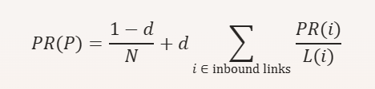
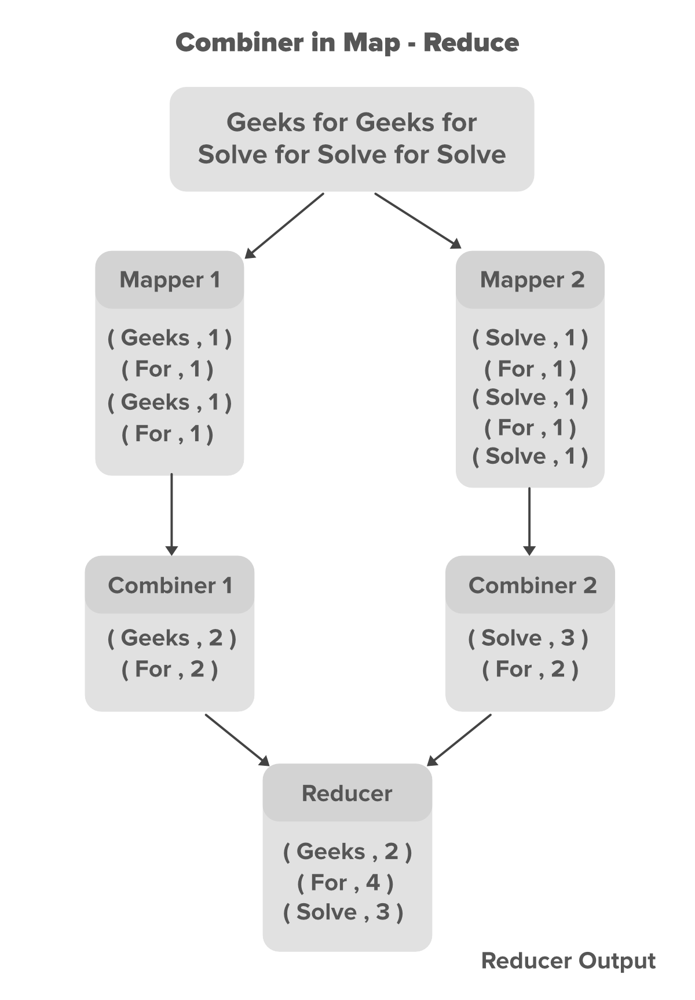

# 1. PageRank: 
is an algorithm used by Google Search to rank web pages in their search engine results. It measures the importance of web pages based on 
the number and quality of links to them. In PageRank, the web is represented as a graph:
- Each web page is a node.
- Each hyperlink from one page to another is a directed edge. 
Here’s a simplified explanation:

### How PageRank Works
- Basic Idea: Pages that have more links pointing to them are considered more important and are ranked higher.
- Link Weighting: Not all links are equal. Links from highly-ranked pages carry more weight than those from lower-ranked pages.
- Iterative Calculation: PageRank is calculated through an iterative process where the rank of a page is divided among the pages it links to, then summed up to get the PageRank of the linked pages.

### Mathematical Representation
The PageRank of a page `p` is defined as: <br>
`PR(p) = (1 - d / n) + d * ∑ (PR(i) / L(i))`<br>
- `d`: damping factor (usually set to 0.85) to simulate the probability of a random surfer continuing to click on links.
- `n`: Total number of pages.
- `PR(i)`: PageRank of page `i` that links to page `P`
- `L(i)`: Number of outbound links on page `i`.

### Example

Imagine three pages: A, B, and C.

Page A links to B and C.

Page B links to C.

Page C links to A and B.

Initially, each page is given an equal PageRank. Through iterative calculations, PageRank distributes the rank values based on the link structure, resulting in final PageRank values that reflect their importance.

### Applications
- Search Engines: Used by Google to rank web pages in search results.

- Social Networks: Analyzing the importance and influence of individuals within a network.

PageRank revolutionized the way search engines worked by focusing on link structure rather than just content, providing more relevant and reliable search results.


# 2. Working outline of `pageRank`:

- Construct the Graph of Pages:
    - Each webpage is a node.
    - Each hyperlink from one page to another is a directed edge.
- Convert the Graph to a Sparse Matrix:
    - Build an adjacency matrix (link matrix) `𝐿`, where: 
    - `𝐿[𝑖][𝑗] = 1`if page j links to page i; otherwise, it’s 0.
    - Transform `L` into a transition matrix `T` by 
    normalizing each column, so each column sums to 1. 
    This represents the probability of "jumping" to each 
    linked page.
- Construct the PageRank Matrix with Damping:
    - Define the PageRank matrix `𝑀` with damping factor `𝛼`
    - same `pageRank` formula.
- Assign an initial PageRank to each page, typically 1/N, 
where N is the total number of pages. Update PageRank values 
using the formula.

# 3. Efficient computation of PageRank: 
is crucial for handling large-scale web graphs. Here are a few methods to achieve this: 

## 1: Power Iteration Method
This is the most common method for computing PageRank. It involves iteratively updating the PageRank values until convergence. 
Initialization: Assign an initial PageRank to each page, typically `1/N`, where `N` is the total number of pages.
Iteration: Update PageRank values using the formula:


## 2: The sparse matrix method: 
is an efficient way to store and manipulate matrices that contain a large number of zero elements. In a sparse matrix, only the 
non-zero elements are stored along with their row and column indices. This reduces memory usage significantly compared to storing 
all elements, including zeros. This methods is particularly usefull in Calculating `pageRank` of pages in serach engines, as  
most pages only link to a small fraction of other pages in the real-wrold scenario.

### Storage Formats:
- Compressed Sparse Row (CSR): Stores non-zero elements along with the row pointers and column indices. This format is efficient for row slicing and matrix-vector multiplication.
- Compressed Sparse Column (CSC): Similar to CSR but optimized for column slicing operations.
- Coordinate List (COO): Stores a list of (row, column, value) tuples. It's easy to construct but less efficient for arithmetic operations compared to CSR and CSC.

### Advantages
- Memory Efficiency: Only non-zero elements are stored, reducing memory usage.
- Computational Efficiency: Sparse matrix operations are faster due to reduced data access and manipulation.

### Applications
- Search Engines: Efficiently computing PageRank for large web graphs.
- Graph Algorithms: Handling large-scale networks in social media, transportation, and biological networks.

## 3: Parallel and Distributed Computing
For very large graphs, parallel and distributed computing techniques are employed.
- MapReduce: Implement the PageRank algorithm using the MapReduce programming model to distribute the computations across multiple nodes.
- Graph Processing Systems: Use specialized graph processing frameworks like Apache Giraph or Pregel that are optimized for handling large-scale graph computations.

# 4. PageRank using MapReduce:
MapReduce is a programming model for processing large-scale data across a distributed computing environment. It consists 
of two main phases:
- Map Phase: Processes input data and produces intermediate key-value pairs.
- Reduce Phase: Merges intermediate values associated with the same key.

## Step-by-Step Process of PageRank with MapReduce

Let's go through each step of the PageRank algorithm with MapReduce using a simple example of three pages, **A**, **B**, and **C**.

### Problem Setup

We have three web pages with the following links:
- **A** links to **B** and **C**.
- **B** links to **C**.
- **C** links to **A**.

Assume each page starts with an initial PageRank of 1/3 (since we have three pages).

### 1. Mapper Phase

Each page emits contributions to the pages it links to, based on its current PageRank divided by the number of outbound links.

- **Input for Page A**: `(Page A, [Page B, Page C])`  
  - **Output**: `(Page B, 1/6)`, `(Page C, 1/6)`

- **Input for Page B**: `(Page B, [Page C])`  
  - **Output**: `(Page C, 1/3)`

- **Input for Page C**: `(Page C, [Page A])`  
  - **Output**: `(Page A, 1/3)`

### 2. Reducer Phase

The reducer sums all contributions from inbound links, applies the damping factor \( d \), and adds a random jump factor.

Using \( `d = 0.85` \) and \( `N = 3` \):
  
For **`Page B`** (with contributions `1/6` from `A` and `1/3` from `C`):

`PR(B) = ((1 - 0.85) / 3) + 0.85 * (1/6 + 1/3) = 0.05 + 0.425 = 0.475`


### 3. Iteration

The Map and Reduce steps are repeated for a fixed number of iterations or until the PageRank values converge.

## Pseudo-code for PageRank using MapReduce

```python
# Map Function
def map(url, links, rank):
    for link in links:
        yield (link, rank / len(links))
    yield (url, 0)

# Reduce Function
def reduce(url, ranks):
    new_rank = (1 - d) / N + d * sum(ranks)
    return new_rank
```

### Benefits of Using MapReduce
- Scalability: Can handle large datasets by distributing the computation across multiple machines.
- Efficiency: Parallel processing reduces computation time significantly.
- Fault Tolerance: Built-in fault tolerance mechanisms handle failures in a distributed environment.

By leveraging MapReduce, computing PageRank for a massive web graph becomes feasible and efficient, ensuring that the ranking algorithm can keep up with the ever-growing size of the internet.

# 5. Social networks: 
are the networks that depict the relations between people in the form of a graph for different kinds of analysis. The graph to store the relationships of people is known as Sociogram. All the graph points and lines are stored in the matrix data structure called Sociomatrix. 
A social network can be represented as a graph where:
  - Nodes represent individuals or entities.
  - Edges represent the relationships or connections between these nodes.
### Types of Graphs
- Undirected Graphs: 
Connections have no direction. Example: Friendships on Facebook.
- Directed Graphs: 
Connections have a direction. Example: Followers on Twitter.
- Weighted Graphs: 
Edges have weights representing the strength or frequency of interactions.

### Key Techniques of Analyzing such social graphs:

- Community Detection: 
Identifying groups or clusters of nodes that are more densely connected internally than with the rest of the network. Example: 
Finding interest groups in social media.

- Centrality Measures:
  - Degree Centrality: Number of connections a node has.
  - Betweenness Centrality: Number of times a node acts as a bridge along the shortest path between two other nodes.
  - Closeness Centrality: Measure of how close a node is to all other nodes in the network.

- Link Prediction: 
Predicting future connections between nodes based on current network structure.

- Sentiment Analysis: 
Analyzing the sentiment of communications (e.g., tweets, posts) to gauge public opinion or mood.

- Influence Analysis: 
Identifying influential nodes (people) who can propagate information effectively.

### Applications
- Marketing: 
Targeting influential users to spread messages and products.
- Epidemiology: 
Understanding how diseases spread through populations.
- Recommender Systems: 
Suggesting friends, content, or products based on network analysis.

# 6. Combiners in MapReduce: 
serve as mini-reducers that process intermediate data before it's sent to the reducers. They can significantly optimize the performance of a MapReduce job by reducing the amount of data transferred across the network. How Combiners Work
- Map Phase: 
The mapper processes input data and produces intermediate key-value pairs.
These key-value pairs are then sorted and partitioned by the key.
- Combine Phase:
Before the intermediate data is sent to the reducers, combiners aggregate it at the mapper level.
This reduces the volume of data that needs to be transferred over the network to the reducers.
- Reduce Phase:
The reducers receive the combined data, further aggregating and processing it to produce the final output.

- For example, if we have 1 GBPS(Gigabits per second) of the network in our cluster and we are processing data that is in the range of hundreds of PB(Peta Bytes). Moving such a large dataset over 1GBPS takes too much time to process. The Combiner is used to solve this problem by minimizing the data that got shuffled between Map and Reduce. 


### Advantages of Combiners
- Reduced Data Transfer: 
Minimizes the time taken to transfer data from Mapper to Reducer.
- Smaller Intermediate Output: 
Reduces the size of the intermediate data generated by Mappers.
- Improved Performance: 
Minimizes network congestion, improving overall job performance.
- Reduced Reducer Workload: 
Aggregates data in the Mapper phase, reducing the number of records the Reducer needs to process.
- Enhanced Fault Tolerance: 
Reduces the work needed in re-execution after node failures, improving fault tolerance.
- Better Scalability: 
Lowers the network bandwidth required, enhancing the scalability of MapReduce jobs.
- Optimization: 
Performs preliminary data processing, optimizing the overall MapReduce job and reducing processing time.
### Disadvantages of Combiners
- Disk I/O Overhead: 
Intermediate key-value pairs stored on local disks result in expensive disk input-output operations.
- Execution Uncertainty: 
MapReduce jobs cannot rely on combiners due to the lack of guaranteed execution.
- Increased Resource Usage: 
Additional CPU and memory resources are required, increasing overall resource usage.
- Effectiveness Variability: 
Depending on the data and operations, combiners may sometimes increase data transfer, reducing performance.
- Potential Data Inconsistencies: 
Incorrectly implemented combiners can introduce data inconsistencies, especially if operations are not associative or commutative.
- Added Complexity: 
Introduces additional logic to the MapReduce code, making maintenance and debugging more complex.

# 7. Collaborative-based recommendation: 
also known as collaborative filtering, is a popular technique used in recommender systems to suggest items to users based on the preferences and behaviors of other users. 

### Types of Collaborative Filtering: 

- User-Based Collaborative Filtering:
This method finds users who are similar to the target user and recommends items that those similar users have liked. ex: If User A and User B both liked movies X and Y, and User B also liked movie Z, then movie Z is recommended to User A.

- Item-Based Collaborative Filtering:
This method finds items that are similar to the items the target user has liked and recommends those similar items. ex: If User A liked movies X and Y, and movie Z is similar to movie X, then movie Z is recommended to User A.

### Steps Involved

- Data Collection:
Collect data on user interactions with items, such as ratings, purchases, or clicks.

- Similarity Calculation:
Calculate the similarity between users or items using metrics like cosine 
similarity, Pearson correlation, or Jaccard index.
- Prediction:
Predict the rating or preference a user might have for an item based on the 
similarities calculated.
- Recommendation:
Recommend the top-N items with the highest predicted ratings or preferences to the 
user.

### Advantages

- Serendipity: 
Can recommend items that the user might not have discovered on their own.

- No Need for Item Metadata: 
Does not require detailed information about the items, only user interaction data.

### Challenges

- Cold Start Problem: 
Difficult to recommend items to new users or recommend new items due to lack of interaction data.

- Scalability: 
Can be computationally intensive with a large number of users and items.

- Sparsity: 
User-item interaction matrices are often sparse, making it challenging to find similarities.

### Applications

- E-commerce: 
Amazon uses collaborative filtering to recommend products.

- Streaming Services: 
Netflix and Spotify use it to recommend movies and music.

- Social Media: 
Platforms like Facebook and Twitter use it to recommend friends and content.


