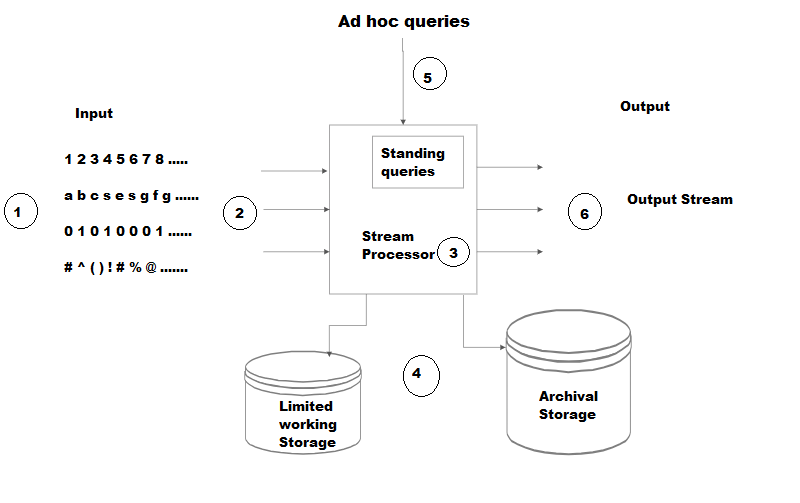

# 1. PageRank: 
is an algorithm used by Google Search to rank web pages in their search engine results. It measures the importance of web pages based on 
the number and quality of links to them. In PageRank, the web is represented as a graph:
- Each web page is a node.
- Each hyperlink from one page to another is a directed edge. 
Here’s a simplified explanation:

### How PageRank Works
- Basic Idea: Pages that have more links pointing to them are considered more important and are ranked higher.
- Link Weighting: Not all links are equal. Links from highly-ranked pages carry more weight than those from lower-ranked pages.
- Iterative Calculation: PageRank is calculated through an iterative process where the rank of a page is divided among the pages it links to, then summed up to get the PageRank of the linked pages.

### Mathematical Representation
The PageRank of a page `p` is defined as: <br>
`PR(p) = (1 - d / n) + d * ∑ (PR(i) / L(i))`<br>
- `d`: damping factor (usually set to 0.85) to simulate the probability of a random surfer continuing to click on links.
- `n`: Total number of pages.
- `PR(i)`: PageRank of page `i` that links to page `P`
- `L(i)`: Number of outbound links on page `i`.

### Example

Imagine three pages: A, B, and C.

Page A links to B and C.

Page B links to C.

Page C links to A and B.

Initially, each page is given an equal PageRank. Through iterative calculations, PageRank distributes the rank values based on the link structure, resulting in final PageRank values that reflect their importance.

### Applications
- Search Engines: Used by Google to rank web pages in search results.

- Social Networks: Analyzing the importance and influence of individuals within a network.

PageRank revolutionized the way search engines worked by focusing on link structure rather than just content, providing more relevant and reliable search results.


# 2. Working outline of `pageRank`:

- Construct the Graph of Pages:
    - Each webpage is a node.
    - Each hyperlink from one page to another is a directed edge.
- Convert the Graph to a Sparse Matrix:
    - Build an adjacency matrix (link matrix) `𝐿`, where: 
    - `𝐿[𝑖][𝑗] = 1`if page j links to page i; otherwise, it’s 0.
    - Transform `L` into a transition matrix `T` by 
    normalizing each column, so each column sums to 1. 
    This represents the probability of "jumping" to each 
    linked page.
- Construct the PageRank Matrix with Damping:
    - Define the PageRank matrix `𝑀` with damping factor `𝛼`
- Assign an initial PageRank to each page, typically 1/N, 
where N is the total number of pages. Update PageRank values 
using the `same formula 👆`.

# 3. Efficient computation of PageRank: 
is crucial for handling large-scale web graphs. Here are a few methods to achieve this: 

## 1: Power Iteration Method
This is the most common method for computing PageRank. It involves iteratively updating the PageRank values until convergence. 
Initialization: Assign an initial PageRank to each page, typically `1/N`, where `N` is the total number of pages.
Iteration: Update PageRank values using the formula:


## 2: The sparse matrix method: 
is an efficient way to store and manipulate matrices that contain a large number of zero elements. In a sparse matrix, only the 
non-zero elements are stored along with their row and column indices. This reduces memory usage significantly compared to storing 
all elements, including zeros. This methods is particularly usefull in Calculating `pageRank` of pages in serach engines, as  
most pages only link to a small fraction of other pages in the real-wrold scenario.

### Storage Formats:
- Compressed Sparse Row (CSR): Stores non-zero elements along with the row pointers and column indices. This format is efficient for row slicing and matrix-vector multiplication.
- Compressed Sparse Column (CSC): Similar to CSR but optimized for column slicing operations.
- Coordinate List (COO): Stores a list of (row, column, value) tuples. It's easy to construct but less efficient for arithmetic operations compared to CSR and CSC.

### Advantages
- Memory Efficiency: Only non-zero elements are stored, reducing memory usage.
- Computational Efficiency: Sparse matrix operations are faster due to reduced data access and manipulation.

### Applications
- Search Engines: Efficiently computing PageRank for large web graphs.
- Graph Algorithms: Handling large-scale networks in social media, transportation, and biological networks.

## 3: Parallel and Distributed Computing
For very large graphs, parallel and distributed computing techniques are employed.
- MapReduce: Implement the PageRank algorithm using the MapReduce programming model to distribute the computations across multiple nodes.
- Graph Processing Systems: Use specialized graph processing frameworks like Apache Giraph or Pregel that are optimized for handling large-scale graph computations.

# 4. PageRank using MapReduce:
MapReduce is a programming model for processing large-scale data across a distributed computing environment. It consists 
of two main phases:
- Map Phase: Processes input data and produces intermediate key-value pairs.
- Reduce Phase: Merges intermediate values associated with the same key.

## Step-by-Step Process of PageRank with MapReduce

Let's go through each step of the PageRank algorithm with MapReduce using a simple example of three pages, **A**, **B**, and **C**.

### Problem Setup

We have three web pages with the following links:
- **A** links to **B** and **C**.
- **B** links to **C**.
- **C** links to **A**.

Assume each page starts with an initial PageRank of 1/3 (since we have three pages).

### 1. Mapper Phase

Each page emits contributions to the pages it links to, based on its current `PageRank` divided by the number of `outbound links`.

- **Input for Page A**: `(Page A, [Page B, Page C])`  
  - **Output**: `(Page B, 1/6)`, `(Page C, 1/6)`

- **Input for Page B**: `(Page B, [Page C])`  
  - **Output**: `(Page C, 1/3)`

- **Input for Page C**: `(Page C, [Page A])`  
  - **Output**: `(Page A, 1/3)`

### 2. Reducer Phase

The reducer sums all contributions from inbound links, applies the damping factor \( d \), and adds a random jump factor.

Using \( `d = 0.85` \) and \( `N = 3` \):
  
For **`Page B`** (with contributions `1/6` from `A` and `1/3` from `C`):

`PR(B) = ((1 - 0.85) / 3) + 0.85 * (1/6 + 1/3) = 0.05 + 0.425 = 0.475`


### 3. Iteration

The Map and Reduce steps are repeated for a fixed number of iterations or until the PageRank values converge.

## Pseudo-code for PageRank using MapReduce

```python
# Map Function
def map(url, links, rank):
    for link in links:
        yield (link, rank / len(links))
    yield (url, 0)

# Reduce Function
def reduce(url, ranks):
    new_rank = (1 - d) / N + d * sum(ranks)
    return new_rank
```

### Benefits of Using MapReduce
- Scalability: Can handle large datasets by distributing the computation across multiple machines.
- Efficiency: Parallel processing reduces computation time significantly.
- Fault Tolerance: Built-in fault tolerance mechanisms handle failures in a distributed environment.

By leveraging MapReduce, computing PageRank for a massive web graph becomes feasible and efficient, ensuring that the ranking algorithm can keep up with the ever-growing size of the internet.


# 5. Combiners in MapReduce: 
serve as `mini-reducers` that process intermediate data before it's sent to the `reducers`. They can significantly optimize the performance of a MapReduce job by reducing the amount of data transferred across the network. How Combiners Work
- **Map Phase:**
The mapper processes input data and produces intermediate key-value pairs.
These key-value pairs are then sorted and partitioned by the key.
- **Combine Phase:**
Before the intermediate data is sent to the reducers, combiners aggregate it at the mapper level.
This reduces the volume of data that needs to be transferred over the network to the reducers.
- **Reduce Phase:**
The reducers receive the combined data, further aggregating and processing it to produce the final output.

- **For example**, if we have 1 GBPS(Gigabits per second) of the network in our cluster and we are processing data that is in the range of hundreds of PB(Peta Bytes). Moving such a large dataset over 1GBPS takes too much time to process. The Combiner is used to solve this problem by minimizing the data that got shuffled between Map and Reduce. 


### Advantages of Combiners
- **Reduced Data Transfer:** 
Minimizes the time taken to transfer data from Mapper to Reducer.
- **Smaller Intermediate Output:** 
Reduces the size of the intermediate data generated by Mappers.
- **Improved Performance:** 
Minimizes network congestion, improving overall job performance.
- **Reduced Reducer Workload:** 
Aggregates data in the Mapper phase, reducing the number of records the Reducer needs to process.
- **Enhanced Fault Tolerance:** 
Reduces the work needed in re-execution after node failures, improving fault tolerance.
- **Better Scalability:** 
Lowers the network bandwidth required, enhancing the scalability of MapReduce jobs.
- **Optimization:** 
Performs preliminary data processing, optimizing the overall MapReduce job and reducing processing time.
### Disadvantages of Combiners
- **Disk I/O Overhead:** 
Intermediate key-value pairs stored on local disks result in expensive disk input-output operations.
- **Execution Uncertainty:** 
MapReduce jobs cannot rely on combiners due to the lack of guaranteed execution.
- **Increased Resource Usage:** 
Additional CPU and memory resources are required, increasing overall resource usage.
- **Effectiveness Variability:** 
Depending on the data and operations, combiners may sometimes increase data transfer, reducing performance.
- **Potential Data Inconsistencies:** 
Incorrectly implemented combiners can introduce data inconsistencies, especially if operations are not associative or commutative.
- **Added Complexity:** 
Introduces additional logic to the MapReduce code, making maintenance and debugging more complex.


# 6. Collaborative-based recommendation: 
also known as collaborative filtering, is a popular technique used in recommender systems to suggest items to users based on the preferences and behaviors of other users. 

### Types of Collaborative Filtering: 

- **User-Based Collaborative Filtering:**
This method finds users who are similar to the target user and recommends items that those similar users have liked. ex: If User A and User B both liked movies X and Y, and User B also liked movie Z, then movie Z is recommended to User A.

- **Item-Based Collaborative Filtering:**
This method finds items that are similar to the items the target user has liked and recommends those similar items. ex: If User A liked movies X and Y, and movie Z is similar to movie X, then movie Z is recommended to User A.

### Steps Involved

- **Data Collection**:
Collect data on user interactions with items, such as ratings, purchases, or clicks.

- **Similarity Calculation**:
Calculate the similarity between users or items using metrics like cosine 
similarity, Pearson correlation, or Jaccard index.
- **Prediction**:
Predict the rating or preference a user might have for an item based on the 
similarities calculated.
- **Recommendation**:
Recommend the top-N items with the highest predicted ratings or preferences to the 
user.

### Advantages

- **Serendipity:** 
Can recommend items that the user might not have discovered on their own.

- **No Need for Item Metadata:** 
Does not require detailed information about the items, only user interaction data.

### Challenges

- **Cold Start Problem:** 
Difficult to recommend items to new users or recommend new items due to lack of interaction data.

- **Scalability:** 
Can be computationally intensive with a large number of users and items.

- **Sparsity:** 
User-item interaction matrices are often sparse, making it challenging to find similarities.

### Applications

- **E-commerce:** 
Amazon uses collaborative filtering to recommend products.

- **Streaming Services:** 
Netflix and Spotify use it to recommend movies and music.

- **Social Media:** 
Platforms like Facebook and Twitter use it to recommend friends and content.


# 7. Social networks: 
are the networks that depict the relations between people in the form of a graph for different kinds of analysis. The graph to store the relationships of people is known as Sociogram. All the graph points and lines are stored in the matrix data structure called Sociomatrix. 
A social network can be represented as a graph where:
  - Nodes represent individuals or entities.
  - Edges represent the relationships or connections between these nodes.

### Reasons for Using Social Network Graphs in Big Data Analysis

- **Relationship and Community Analysis**
Graphs help identify clusters or communities within a network, revealing groups with shared interests or strong connections, which can be valuable for targeted marketing.

- **Influencer and Centrality Detection**
By analyzing central nodes or highly connected users, businesses can identify influencers or key players who might drive trends, leading to more effective marketing strategies.

- **Sentiment and Behavior Prediction**
Graphs capture how users engage with each other, allowing analysts to predict sentiment changes or behavioral trends across a network, such as spreading rumors, preferences, or trends.

- **Recommendations**
Social network graphs are used to improve recommendation engines, as they can suggest friends, groups, or content based on a user's connections and activities.

- **Fraud Detection**
In financial or commerce-oriented networks, graphs reveal unusual patterns or suspicious relationships between nodes, aiding in fraud detection and cybersecurity.

- **Centrality Measures**:
  - **Degree Centrality:** Number of connections a node has.
  - **Betweenness** Centrality: Number of times a node acts as a bridge along the shortest path between two other nodes.
  - **Closeness** Centrality: Measure of how close a node is to all other nodes in the network.

### Applications
- Marketing: 
Targeting influential users to spread messages and products.
- Epidemiology: 
Understanding how diseases spread through populations.
- Recommender Systems: 
Suggesting friends, content, or products based on network analysis.


# 8. The Clique Percolation Method (CPM): 
is a technique used in `network analysis` to identify `overlapping communities or clusters` within complex networks. Unlike traditional methods that identify non-overlapping groups, CPM is `well-suited for uncovering` overlapping communities, which are common in social networks, where a person can belong to multiple groups (e.g., family, work, and hobby groups).

### How Clique Percolation Works

- **Defining Cliques:**
In graph theory, a clique is a `subset of nodes where every node is directly connected to every other node`. For example, a "k-clique" is a fully connected subgraph containing `𝑘` nodes.

- **Locating Cliques in the Network:**
CPM identifies all the k-cliques (groups of 
`𝑘` fully connected nodes) in the network. These k-cliques serve as the initial `"building blocks"` for detecting communities.

- **Percolating Cliques:**
  - The method then looks for `adjacent k-cliques` that share `k − 1` nodes. 
  - If two k-cliques have `k − 1` nodes in common, they are considered connected. 
  - This connectivity is `"percolative"` , meaning that if a k-clique is connected to another, it can indirectly connect to other k-cliques, forming larger overlapping communities.

- **Forming Communities:**
By aggregating all k-cliques that are connected through shared nodes, CPM builds clusters or communities. These clusters may overlap, representing the real-world situation where entities belong to multiple groups.

- **Threshold Selection:**
The choice of `k` affects the community structure. Smaller values of `𝑘` create larger communities, while larger values yield smaller, more tightly connected communities. Selecting an optimal `𝑘` is crucial to accurately represent the network’s community structure.

### Limitations of Clique Percolation

- **Computational Complexity:** High resource demands for larger k-clique detections in large networks.
- **Sensitivity to k Selection:** Incorrect `k` choice can lead to missed or overly fragmented communities.

### Applications of Clique Percolation

- Social Networks: Detects overlapping groups like friend and professional networks.
- Biological Networks: Helps find overlapping functional groups in protein interactions.
- Marketing/Recommendations

<br>

------------------------------------------------------------------------------------------------------------------------------------------

# `UNIT - 5`


# 1. Distance measures: 
are the backbone of clustering algorithms. `Distance measures are mathematical functions that determine how similar or different two data points are`. The choice of distance measure can significantly impact the clustering results, as it influences the shape and structure of the clusters.
(Clustering is a fundamental concept in data analysis and machine learning, where the goal is to group similar data points into clusters based on their characteristics.)
### Common Distance Measures
- **Euclidean Distance**
is the most widely used distance measure in clustering. It calculates the `straight-line` distance between two points in `n-dimensional space`. The formula for Euclidean distance is:<br>
`d(p,q)= Σ i=1n​ sqrt((pi​ − qi)^2)`
where,
  - `p` and `q` are two data points
  - and `n` is the number of dimensions.

- **Cosine similarity**: 
measures the `cosine` of the angle between two non-zero vectors in an `inner product space`. It's a measure used to determine how similar two vectors are, and it ranges from `-1 to 1`, with 1 indicating that the vectors are identical, and -1 indicating they are diametrically opposed.
<br>
Essentially, cosine similarity `captures the orientation rather than the magnitude`. It’s heavily used in text analysis to compare document similarity, like in search engines or recommendation systems
Here's the formula:<br>
`cosine similarity = cos(θ) = A ⋅ B / ∥A∥ ∥B∥`
Where:
  - `A ⋅ B` is the dot product of vectors A and B,
  - `∥A∥` and `∥B∥` are the `magnitudes` of vectors `A` and `B`.

- **Cosine distance**: 
is derived from cosine similarity and is used to measure dissimilarity. It's calculated as:
<br>
`cosine distance = 1 − cosine similarity`

- **Jaccard distance**: 
measures the dissimilarity between two sets. It’s complementary to `Jaccard similarity:
is the ratio of the size of the intersection of the sets to the size of their union.`
Jaccard distance is used in various applications, such as clustering and classification, especially in scenarios involving binary or categorical data.
Here's the formula for Jaccard distance:
`Jaccard distance = 1 − ∣ A ∩ B ∣ / ∣ A ∪ B∣`, where
  - `A` and `B` are two sets.
  - `∣ A ∩ B ∣` is the number of elements in the `intersection` of `A` and `B`.
  - `∣ A ∪ B ∣` is the number of elements in the `union` of `A` and `B`.

- **Hamming Distance**: 
measures the number of differing positions between two strings of equal length. It's a simple yet powerful way to quantify how different two strings are.
It's particularly useful in error detection and correction coding. If two binary codes differ in a small number of bits, it’s easier to correct errors caused by transmission or storage.

- **Edit Distance**: 
often referred to as `Levenshtein Distance`, measures how many single-character edits `(insertions, deletions, or substitutions)` are needed to change one string into another. It's vital for applications like spell checking, DNA sequencing, and natural language processing.

# 2. The CURE (Clustering Using Representatives) algorithm:
is a clustering method `optimized for large datasets` and `robust against outliers`. It improves on traditional hierarchical clustering by supporting `clusters of various shapes and sizes` and `reducing computational complexity`. CURE finds a `middle ground` between `centroid-based` and `all-points extremes`, using `set of representative points rather than a single centroid`, which helps manage clusters efficiently and handle outliers.

    - is a clustering method designed to handle large datasets and outliers. 
    - It is an improvement over traditional hierarchical clustering methods and works well with clusters of arbitrary shapes and sizes.
    - CURE reduces the time complexity of hierarchical clustering while being robust to outliers.
    - It is a hierarchical based clustering technique, that adopts a middle ground between the centroid based and the all-point extremes. 
    - Hierarchical clustering is a type of clustering, that starts with a single point cluster, and moves to merge with another cluster, until the desired number of clusters are formed.
    - It is used for identifying the spherical and non-spherical clusters.
    - It is useful for discovering groups and identifying interesting distributions in the underlying data.
    - Instead of using one point centroid, as in most of data mining algorithms,
    - CURE uses a set of well-defined representative points, for efficiently handling the clusters and eliminating the outliers.

### Here are the six steps involved in the CURE algorithm:

- **Random Sampling:** 
A random sample of the dataset is selected to reduce the computational complexity.
- **Partitioning:** 
The random sample is partitioned into smaller subsets.
- **Partial Clustering:** 
Each partition is partially clustered independently.
- **Outlier Removal:** 
Outliers are identified and removed from each partition.
- **Merging:** 
The partially clustered partitions are merged to form the final clusters.
- **Labeling:** 
The remaining data points are assigned to the nearest cluster.

### Here’s a block diagram to illustrate these steps:


# 3. Sampling methods: 

are techniques used to select a subset of individuals or elements from a larger population for research purposes. Here are some common sampling methods:

- **Simple Random Sampling:** 
Every member of the population has an equal chance of being selected. This can be done using random number generators or drawing names from a hat.

- **Stratified Sampling:** 
The population is divided into subgroups (strata) based on specific characteristics, and random samples are taken from each stratum.

- **Cluster Sampling:** 
The population is divided into clusters, usually based on geographical areas or institutions. Entire clusters are randomly selected, and all members of the chosen clusters are included in the sample.

- **Systematic Sampling:** 
Every nth member of the population is selected after a random starting point. For example, selecting every 10th person on a list.

- **Convenience Sampling:** 
Samples are taken from a group that is conveniently accessible to the researcher. This method is quick and easy but may not be representative of the entire population.

- **Quota Sampling:** 
The researcher ensures that certain characteristics are represented in the sample to a predetermined extent. For example, ensuring that the sample includes a specific number of males and females.

# 4.  Data Streams
is a continuous, real-time flow of data points that are typically generated by various sources. These data points are sequentially ordered and often unbounded, meaning they can potentially go on indefinitely. Examples include sensor readings, social media feeds, financial market data, and server log files.

### Key characteristics of data streams:
- Continuous: 
Data keeps flowing without end, unlike traditional datasets that are finite.
- High Volume and Velocity: 
Often generated at high speed, resulting in large amounts of data.
- Real-Time: 
Data needs to be processed or analyzed immediately upon arrival, often without storing it permanently.
- Dynamic and Transient: 
Data values may only be relevant for a limited time.


# 5. Data Stream Analysis
(or stream analytics) is the process of analyzing data as it flows in real time. Unlike batch processing, where all data is collected first and then analyzed, data stream analysis enables immediate processing to extract insights, detect patterns, or respond to events as they happen.

### Types of analysis in data stream analysis include:

- Filtering: 
Selecting relevant data points (e.g., filter logs for specific error codes).
- Aggregation: 
Summing, averaging, or counting over a time window (e.g., hourly average temperature).
- Pattern Recognition: 
Detecting patterns or anomalies (e.g., fraud detection in credit card transactions).
- Event Detection: 
Identifying specific events (e.g., identifying peaks in network traffic).
- Predictive Analytics: 
Using algorithms to forecast future events based on current data trends.

------------------------------------------------------------------------------------------------------------------------------------------

# `UNIT - 4` 

<br>

# 1. Data Stream Management System
DSMS stands for data stream management system. It is nothing but a software application just like DBMS (database management system) but it involves processing and management of a continuously flowing data stream rather than static data like Excel PDF or other files. 


Unlike traditional Database Management Systems (DBMS), where data is `stored and queried later`, DSMS handles fast-moving data from sources like sensors, social media feeds, or financial transactions. It processes data as it flows, `allowing organizations` to get `instant insights and make quick decisions` based on `real-time information`.
DSMS is particularly useful for applications such as real-time monitoring, live data analytics, and event detection, where timely decision-making is crucial.
It is generally used to deal data streams from with various sources which include sensor data, social media fields, financial reports, etc.

Just like DBMS, DSMS also provides a wide range of operations like storage, processing, analyzing, integration also helps to generate the visualization and report only used for data streams.

There are wide range of DSMS applications available in the market among them Apache Flint, Apache Kafka, Apache Storm, Amazon kinesis, etc. DSMS processes 2 types of queries standard queries and ad hoc queries.



DSMS consists of various layer which are dedicated to perform particular operation which are as follows:

- **Data Source Layer:** 
Collects data from various sources like sensors, social media, and financial markets.

- **Data Ingestion Layer:** 
Manages data flow between the source and processing layers, handling buffering and routing.

- **Processing Layer:** 
The core of DSMS, processes data streams in real-time using engines like Apache Flink or Storm, 
performing tasks like filtering, transforming, and aggregating data.
- **Storage Layer:** 
Stores processed data in systems like NoSQL or distributed databases, ensuring durability and 
availability.
- **Querying Layer:** 
Provides tools for querying and analyzing stored data, supporting `both ad hoc and standard queries`.

- **Visualization and Reporting Layer:** 
Offers tools for visualizing data (charts, histograms) and generating reports.

- **Integration Layer:** 
Integrates DSMS with traditional systems, BI tools, data warehouses, and ML/NLP applications.

# 2. Stream queries: 
are continuous queries that filter, aggregate, or transform incoming stream data in real time. These queries are typically run using stream processing frameworks like Apache Flink, Apache Spark Streaming, or SQL engines adapted for streaming.

### Examples of stream queries include:

- **Filtering Events**
Selecting only specific events based on certain criteria from a stream of events.
  - **Example:** Filtering for error codes from a web server log stream to monitor failures in real time.

- **Windowed Aggregations**
Calculating metrics like average, count, or sum over time windows (e.g., sliding or tumbling windows).
  - **Example:** Calculating the average CPU usage every 5 minutes from a continuous stream of server metrics.

- **Pattern Matching**
Detecting specific sequences or patterns in event streams, often used for fraud detection.
  - **Example:** Identifying sequences where a user logs in from multiple IP addresses within a short period.

- **Counting Unique Items**
Using approximate counting algorithms (like HyperLogLog) to count unique values in high-throughput streams.
  - **Example:** Counting unique visitors in real time on a website.

- **Anomaly Detection**
Detecting values that deviate from an expected range in real-time data.
  - **Example:** Detecting temperature values from a sensor that fall outside a normal range.

- **Real-Time Analytics**
Continuously monitoring metrics for dashboards.
  - **Example:** Real-time dashboard of website traffic, showing the number of active users and page views.

# 3. Querying large data streams presents several challenges:

- **High Throughput and Low Latency:** 
Data streams often require real-time processing, meaning the system must handle high volumes of data with minimal delay. This necessitates efficient algorithms and optimized hardware.

- **Data Heterogeneity:** 
Streams can come from various sources and in different formats, making it difficult to standardize and process the data uniformly.

- **Dynamic and Unbounded Nature:** 
Unlike static datasets, data streams are continuous and potentially infinite. This requires the system to manage memory and storage efficiently, often using techniques like windowing to process manageable chunks of data.

- **Complex Query Processing:** 
Queries on data streams can be complex, involving joins, aggregations, and other operations that are computationally intensive. Ensuring these queries run efficiently in real-time is a significant challenge.

- **Fault Tolerance and Reliability:** 
Ensuring the system can recover from failures without losing data or processing time is crucial. This involves implementing robust fault-tolerance mechanisms.

- **Scalability:** 
As data volumes grow, the system must scale horizontally (adding more machines) or vertically (upgrading existing machines) to maintain performance.

- **Security and Privacy:** 
Protecting sensitive data in streams and ensuring compliance with privacy regulations adds another layer of complexity.

# 4. Sampling data in a stream: 
is essential when dealing with large or continuous data flows that are too fast or vast to process and store in their entirety. Sampling techniques allow us to select a representative subset of the data for analysis, monitoring, and decision-making without overwhelming computational resources. Here are some key techniques used for sampling data in a stream:

- **Random Sampling**: 
Randomly selects elements from the stream with equal probability. This is simple and effective but may not work well if the stream is biased or if some data patterns are only apparent in specific segments of the stream.

- **Systematic Sampling**:
In systematic sampling, every `𝑘𝑡ℎ` element from the stream is selected, where `𝑘` is a fixed interval. For example, if `𝑘 = 10`, then the 10th, 20th, 30th, and so on elements would be chosen. This approach is simple but may miss important trends if the data has periodic patterns.

- **Stratified Sampling**: 
In stratified sampling, the stream is divided into "strata" (sub-groups) based on some characteristic, and random samples are taken from each group. This ensures that each stratum is represented, which is useful when the stream has known, heterogeneous segments.

- **Time-Based Sampling**:
This method samples data points at regular time intervals (e.g., every second or every minute). It’s particularly useful in streaming applications where data frequency fluctuates over time.

- **Adaptive Sampling**:
dynamically adjusts the sampling rate based on the characteristics of the stream, such as data volume, rate of change, or significance of events. For example, during peak data rates, the sampling rate can be increased, else, it can be decreased.

# 5. Bloom filters:
is a **space-efficient probabilistic data structure** that is used to test whether an element is a member of a set. The price we pay for efficiency is that it is probabilistic in nature that means, `there might be some False Positive results`. False positive means, it might tell that given username is already taken but actually it’s not. `Bloom filters never generate false negative result, i.e., telling you that a username doesn’t exist when it actually exists.`

### Working

- **Array of Bits**: 
A Bloom filter consists of a fixed-size bit array initialized to all 0s. The size of the array is determined based on the expected number of elements to be added and the desired false positive rate.


- **Hash Functions:**
The Bloom filter uses multiple hash functions, each of which takes an input (an element) and produces an index in the bit array. The number of hash functions affects the probability of false positives.


- **Inserting an Element:**
When an element `𝑋` is added to the Bloom filter, the following steps occur:
  - Each hash function is applied to the element `𝑋` to generate multiple indices in the bit array.
  - For each generated index, the corresponding bit in the array is set to 1. This process marks that the element might be present in the set.

- **Checking Membership:**
To check if an element `𝑌` is in the Bloom filter:
  - Each hash function is applied to `𝑌` to generate the same number of indices.
  - If all the bits at these indices are 1, it indicates that `𝑌` is possibly in the set `(though it could be a false positive)`.
  - If any of the bits is 0, it confirms that `𝑌` is definitely not in the set.

#### Bloom filters are incredibly useful in big data analytics due to their space-efficient and probabilistic nature. Here are some key benefits:

- **Space Efficiency:** 
Bloom filters use a bit array and multiple hash functions to represent a set, which requires significantly less memory compared to storing the actual data.

- **Fast Membership Testing:** 
They allow for quick checks to determine if an element is definitely not in a set or possibly in a set. This is particularly useful for filtering out non-relevant data early in the processing pipeline.

- **Handling Large Datasets:** 
In big data scenarios, where datasets can be enormous, Bloom filters help in reducing the amount of data that needs to be processed by eliminating duplicates and irrelevant entries efficiently.

- **Applications in Various Domains:** 
They are used in databases for indexing, in network security for detecting malicious URLs, and in distributed systems for efficient data synchronization.

# 6. Counting distinct elements in a stream: 
is a common problem in computer science, particularly in the context of big data and data streams. The goal is to determine the number of unique elements in a potentially infinite stream of data, where storing all elements is impractical due to memory constraints.

- Naive Approach:
Store all elements in a set and count the size of the set.
Requires significant memory, making it impractical for large data streams.

- Probabilistic Algorithms:
    - Flajolet-Martin Algorithm Uses hash functions and bit patterns to estimate the number of distinct elements. It is efficient in terms of memory usage.

    - HyperLogLog: An improvement over Flajolet-Martin, providing more accurate estimates with even less memory.
### Applications
- Network Traffic Analysis: Counting unique IP addresses.
- Database Management: Estimating the number of distinct queries.
- Web Analytics: Counting unique visitors to a website.

# 7. The Flajolet-Martin Algorithm:
is a **probabilistic algorithm** for estimating the number of distinct elements `(also called the cardinality)` in a large data stream. It’s useful for applications where it’s impractical to store all elements due to memory constraints, like web traffic analysis or unique user counts.

### Working

- Hashing and Bit Patterns:
Each element in the stream is hashed to produce a unique hash value, which converts each `element into a pseudo-random binary string`.
- Counting Leading Zeros: For each hash, the algorithm tracks the maximum number of leading zeros observed denoted as `R`.
- Estimate Cardinality:
The observed maximum number of leading zeros, `𝑅`, gives an estimate of the number of unique elements in the stream and is approximated as `D ~= 2^R`

### Example
Example
Suppose we have a stream of elements: `["apple", "banana", "apple", "orange", "banana", "apple", "kiwi", "banana", "kiwi"]`<br>

- **Hash Each Element:** 
Use a hash function to map each element to a binary value. Let's say our hash function gives us the following 8-bit binary values (these are just for illustration):

      apple → 10011000
      banana → 00101100
      orange → 11100101
      kiwi → 00011110

- **Count leading / trailing Zeros:** 
Now, count the trailing zeros for each hashed value:

      apple (10011000) → 3 trailing zeros
      banana (00101100) → 2 trailing zeros
      orange (11100101) → 0 trailing zeros
      kiwi (00011110) → 1 trailing zero

- The maximum number of leading `0's` observed is `3`, so `estimate of distinct elements = 2^3 = 8`.
The FM algorithm would estimate that there are about 8 distinct elements, which is close to the actual number of distinct elements (4) in this small example, though generally, `for larger streams, this approximation becomes more accurate`.

### Advantages:

- **Memory-Efficient:** 
Uses minimal memory compared to counting all elements.
- **Scalable:** 
Works well with large data streams.
- **Fast:** 
Only requires hashing and a bitwise operation, making it computationally efficient.

### Limitations:

- **Approximation:** 
Provides an estimate, not an exact count.
- **Dependent on Quality of Hashing:** 
Needs good hash functions to minimize collisions.
- **Variance:** 
Can have high variance; thus, combining multiple estimates (e.g., through harmonic mean) is recommended.

# 8. The decaying window algorithm: 
is a technique used in data stream processing to keep track of recent information while gradually `forgetting` older data. It’s particularly useful in situations where data streams are continuous and unbounded, `and the latest data points are more relevant than the older ones`. The algorithm applies a decay factor to older data so that its influence on the overall calculation diminishes over time.
### Key Concepts
- **Decay Factor:** 
The algorithm applies a decay factor (usually a number between 0 and 1) that determines how quickly older data fades. A higher 
α (close to 1) gives more importance to older data, meaning older points fade slowly. A lower 
α (closer to 0) causes older points to fade out more quickly.
- **Exponential Decay:** 
The decaying window algorithm often relies on `exponential decay`, as it provides a `smooth, gradual decrease in the influence of older data`.
For a data point that arrived at time `t`, its weight at any future time `t*` can be calculated as:
`w = 𝛼^ t* - t`
, where `𝛼` is the `decay factor`.

### How it Works

- With each new data point, the algorithm `recalculates the moving average` by `forgetting` some of the older data at a rate determined by `𝛼`.

- `new_value = 𝛼 × current_value + (1 − 𝛼) × previous_average`<br>

- Every time a new data point is processed, `older data is multiplied by the decay factor`, reducing its weight in the final computation.

### Advantages
- **Low Memory Usage:** Unlike sliding window algorithms that need to store every data point in a set window, the decaying window algorithm only needs to store the current average.
- **Quick Adaptability:** The method can adapt quickly to new trends or changes, making it suitable for real-time data.

### Use Cases
- **Streaming Data:** For real-time analysis where retaining historical data isn’t feasible.
- **Network Monitoring:** To track statistics like packet loss or latency.
- **Anomaly Detection:** Identifying trends and sudden changes in data to flag unusual behavior.

------------------------------------------------------------------------------------------------------------------------------------------

# `UNIT - 3` 

<br>

# 1. NoSQL:
is a type of database management system (DBMS) that is designed to handle and store large volumes of unstructured and semi-structured data. Unlike traditional relational databases that use tables with pre-defined schemas to store data, NoSQL databases use flexible data models that can adapt to changes in data structures and are capable of scaling horizontally to handle growing amounts of data.
### Key Features of NoSQL:

- **Dynamic schema:** 
NoSQL databases do not have a fixed schema and can accommodate changing data structures without the need for migrations or schema alterations.
- **Horizontal scalability:** 
NoSQL databases are designed to scale out by adding more nodes to a database cluster, making them well-suited for handling large amounts of data and high levels of traffic.
- **Document-based:** 
Some NoSQL databases, such as MongoDB, use a document-based data model, where data is stored in a schema-less semi-structured format, such as JSON or BSON.
- **Key-value-based:** 
Other NoSQL databases, such as Redis, use a key-value data model, where data is stored as a collection of key-value pairs.
- **Column-based:** 
Some NoSQL databases, such as Cassandra, use a column-based data model, where data is organized into columns instead of rows.
- **Distributed and high - availability:** 
NoSQL databases are often designed to be highly available and to automatically handle node failures and data replication across multiple nodes in a database cluster.
- **Flexibility:** 
NoSQL databases allow developers to store and retrieve data in a flexible and dynamic manner, with support for multiple data types and changing data structures.
- **Performance:** 
NoSQL databases are optimized for high performance and can handle a high volume of reads and writes, making them suitable for big data and real-time applications.

# 2. NoSQL Types:

### Key-Value Stores
  - **Structure:** Simplest NoSQL model, pairing unique keys with values.
  - **Use Cases:** Ideal for caching, session management, and simple data retrieval tasks.
  - **Examples:** Redis, DynamoDB.
### Document Stores
  - **Structure:** Data is stored as documents (usually JSON or BSON).
  - **Use Cases:** Suitable for content management systems, e-commerce, and complex nested data.
  - **Examples:** MongoDB, CouchDB.
### Column Family Stores (Bigtable)
  - **Structure:** Data is stored in columns, grouped into column families.
  - **Use Cases:** Great for data warehousing and business intelligence applications.
  - **Examples:** Apache Cassandra, HBase.
### Graph Stores
  - **Structure:** Data is represented as nodes, edges, and properties.
  - **Use Cases:** Perfect for social networks, recommendation engines, and fraud detection.
  - **Examples:** Neo4j, Amazon Neptune.

# 3. NoSQL solution for big data
**NoSQL systems are designed to handle big data problems effectively by leveraging several key strategies:**

- **Horizontal Scalability:** 
NoSQL databases can scale out by adding more servers to handle increased loads, rather than scaling up by adding more power to a single server. This allows them to manage large volumes of data efficiently.
- **Distributed Architecture:** 
Data is distributed across multiple nodes, which helps in balancing the load and ensuring high availability. This architecture also supports fault tolerance, as the failure of one node doesn’t affect the overall system.
- **Flexible Data Models:** 
Unlike traditional relational databases, NoSQL databases can handle unstructured or semi-structured data. This flexibility allows them to adapt to changing data requirements without needing a predefined schema.
- **Efficient Query Handling:** 
NoSQL systems often move queries to the data rather than moving data to the queries. This reduces the amount of data transferred over the network, making query processing faster.
- **Replication and Consistency:** 
NoSQL databases use replication to create multiple copies of data across different nodes. This not only ensures data availability but also helps in scaling read requests. Some NoSQL systems offer tunable consistency levels, allowing users to balance between consistency and performance based on their needs.
- **MapReduce and Parallel Processing:** 
Many NoSQL databases support MapReduce, a programming model that allows for processing large data sets with a distributed algorithm on a cluster. This enables efficient data analysis and transformation.

**Popular NoSQL databases like MongoDB, Cassandra, CouchDB, and Neo4j utilize these strategies to handle big data challenges effectively.**

# 4. Shared Nothing Architecture (SNA) 
is a distributed computing model where each node in the system operates independently, without sharing memory or disk storage with other nodes. Here are the key details:

### Core Concepts
- **Independence:** 
Each node has its own memory, storage, and processing power.
- **No Shared Resources:** 
Nodes do not share memory or disk storage, reducing contention and bottlenecks.
- **Communication:** 
Nodes communicate through a high-speed interconnect network, ensuring low latency and high bandwidth.

### Advantages
- **Scalability:** 
Easily add new nodes to handle increased workloads.
- **Fault Tolerance:** 
Failure of one node doesn’t affect others.
- **Performance:** 
Reduced contention leads to better performance.

### Challenges
- **Complexity:** 
Implementing and maintaining the architecture can be complex.
- **Data Consistency:** 
Ensuring data consistency across nodes can be challenging.
- **Network Dependency:** 
Performance heavily depends on the network quality.

# 5. Choosing distribution models: master-slave versus peer-to-peer

When choosing between master-slave and peer-to-peer distribution models, understanding their characteristics, benefits, and potential drawbacks is crucial.

## **Master-Slave Model**
### Characteristics:
- Centralized control:
 One master node controls one or more slave nodes.
- Data flow:
 The master node handles writes and updates, while slave nodes handle reads.
- Synchronization:
 Changes are propagated from the master to the slaves.

### Benefits:
- Simplified management:
Easier to manage and control as the master node orchestrates all operations.
- Read scalability:
Since slave nodes can handle read operations, this model can scale well for read-heavy workloads.

### Drawbacks:
- Single point of failure:
The master node is a critical point of failure. If it goes down, the system can become inoperative.
- Latency issues:
Write operations can experience latency as updates propagate to slave nodes.

## **Peer-to-Peer Model**

### Characteristics:

- Decentralized control:
All nodes are equal and can act as both clients and servers.
- Data flow:
Any node can handle both read and write operations.
- Synchronization:
Nodes communicate directly to share data and updates.

### Benefits:

- Fault tolerance:
No single point of failure, making the system more resilient.
- Scalability:
Can easily scale horizontally as new nodes are added without complex reconfiguration.
- Flexibility:
Better suited for distributed and dynamic environments.

### Drawbacks:
- Complexity:
More complex to manage due to the lack of a centralized controller.
- Consistency challenges:
Ensuring data consistency across nodes can be more difficult.

## **Choosing the Right Model**
### When to use Master-Slave:

- If your application has a high read-to-write ratio.
- If you need easier management and simpler configuration.
- If you can tolerate the single point of failure, perhaps with additional measures like failover strategies.

## **When to use Peer-to-Peer**

- If you require high availability and fault tolerance.
- If your application benefits from decentralized control and equal node participation.
- If you need to scale out quickly and efficiently.